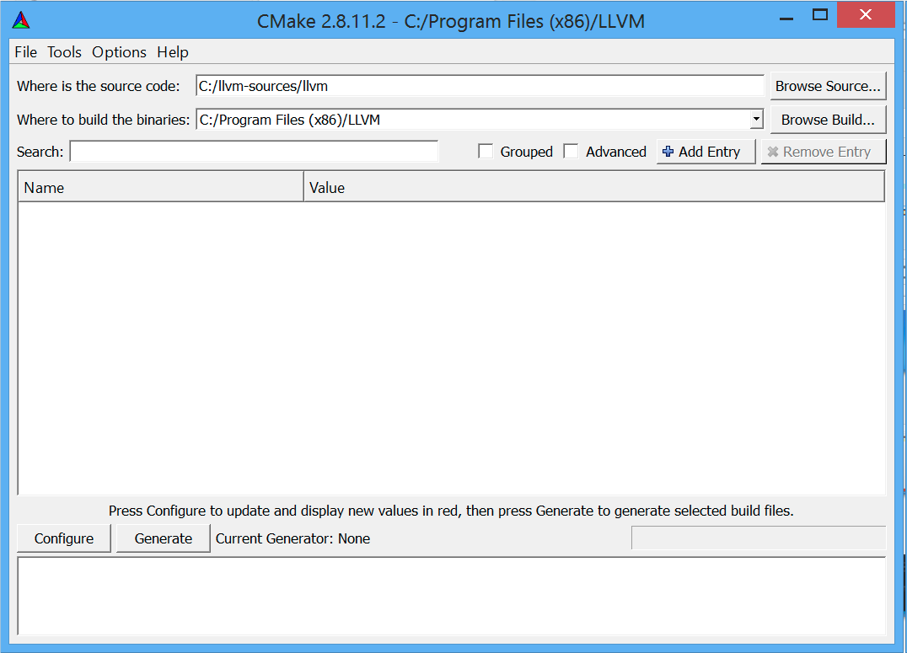
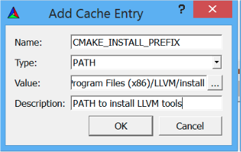
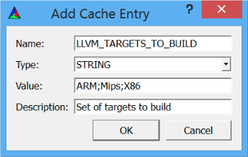
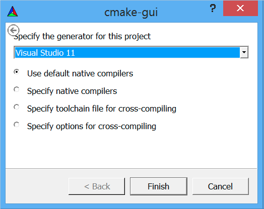

第1章 编译和安装LLVM
##########################

LLVM基础设施适用于若干 **Unix** 系统（GNU/**Linux**，**FreeBSD** ，**Mac OS**）和 **Windows** 系统。在本章中，我们一步一步地说明如何让LLVM在这些系统上工作。某些系统可获得LLVM和Clang的预编译安装包，但是也可以从源代码编译得到它们。

LLVM的新手使用者必须明白，基本的LLVM编译器包括LLVM和Clang的库和工具。因此，本章的目的在于说明如何编译（build）并安装（install）它们。本书自始自终都将聚焦LLVM版本3.4。然而，LLVM是一个年轻的项目，处于活跃的开发期，因此它在不断地改变；知道这一点是重要的。

.. tip::

   写作本书的时候，LLVM 3.5还没有发布。尽管这本书讲解LLVM 3.4，但是我们计划在2014年9月的第三个星期发布一个附录，将本书中的例子更新到LLVM 3.5，让你能够以LLVM最新的版本练习本书的内容。这个附录将可以从 `https://www.packtpub.com/sites/default/files/downloads/6924OS_Appendix.pdf <https://www.packtpub.com/sites/default/files/downloads/6924OS_Appendix.pdf>`_ 得到。

本章将讨论以下内容：

* 理解LLVM的版本
* 利用预编译二进制文件安装LLVM
* 利用包管理器安装LLVM
* 在Linux上从源代码编译LLVM
* 在Windows上利用Visual Studio从源代码编译LLVM
* 在Mac OS X上利用Xcode从源代码编译LLVM

理解LLVM的版本
******************

由于众多程序员的贡献，LLVM项目的更新节奏很快。截止版本3.4，它的SVN（subversion，版本控制系统）仓库记录了超过200,000次提交，而它的第一次发布发生在十多年以前。仅在2013年，项目有接近30,000次新的提交。因此，新的特性不断地被提出，其它特性很快变得过时。与任何大型项目一样，开发者需要遵守严格的规范，当项目状态良好并通过多种测试时，会发布稳定的程序，让使用者既能够使用经过仔细测试的版本，又能够体验最新的特性。

从历史上看，LLVM项目总是每年发布两个稳定的版本。版本发布时增加小版本数字，每次增加1。例如，从版本3.3到版本3.4的更新是一个小版本更新。一旦小版本数字达到了9，下一个版本就会增加大版本数字，也是增加1，比如LLVM 2.9后面是LLVM 3.0。相比前一个版本，大版本数字更新不必是一个大的修改，但是它们大致代表编译器五年的开发演进，如果和最近的大版本更新相比的话。

对于依赖LLVM的项目，常见的做法是使用主干版本，也就是在SVN仓库可以得到的最新的版本，其代价是，这个版本可能是不稳定的。最近，从版本3.4开始，LLVM社区开始着手推出点发布，引入一个新的修订版数字。这项工作的第一个产品是LLVM 3.4.1。点发布的目标是，从主干向最新的标签版本向后移植代码修正，而不引入新的特性，这样保持完全的兼容。每次点发布应该间隔三个月。由于这个新系统还处于婴儿期，在本章中我们将主要介绍LLVM 3.4的安装。LLVM 3.4的预编译包的数量是很大的，但是你应该能够编译LLVM 3.4.1，或者任意其它版本，只要遵循我们的指令，就不会有问题。

获取预编译安装包
****************

为了你能够轻松地在你的系统上安装软件，LLVM贡献者准备了预编译的安装包，就是为特定平台编译的二进制文件，而不需要你自己编译它们。在某种境况下，编译任何软件都可能不是一目了然的；它可能需要花费时间，一般是不必要的，除非你在使用一个特别的平台，或者你在活跃地从事项目开发。因此，如果你想快捷地了解LLVM，就去看一看可获得的预编译安装包。然而，在本书中，我们将鼓励你直接探索LLVM源代码树。你应该准备好能够自己从源代码树编译LLVM。

获取LLVM预编译安装包有两种通常的方法；你可以从官方网站获取二进制文件，也可以从第三方获取GNU/Linux发布的安装包和Windows的安装文件。

获取官方预编译二进制文件
========================

对于版本3.4，可以从官方LLVM网站下载以下预编译包：

============ ===================================================================================================
Architecture Version
============ ===================================================================================================
x86_64       Ubuntu (12.04, 13.10), Fedora 19, Fedora 20, FreeBSD 9.2, Mac OS X 10.9, Windows, and openSUSE 13.1
i386         openSUSE 13.1, FreeBSD 9.2, Fedora 19, Fedora 20, and openSUSE 13.1
ARMv7/ARMv7a Linux-generic
============ ===================================================================================================

要想查看针对不同版本的所有选项，请访问 http://www.llvm.org/releases/download.html ，查看 **Pre-built Binaries** 小节有关你想下载的版本。例如，为了在Ubuntu 13.10上下载LLVM并作系统范围的安装，我们从站点得到文件的URL，并使用下面的命令：

.. code-block:: bash

    $ sudo mkdir -p /usr/local; cd /usr/local
    $ sudo wget http://llvm.org/releases/3.4/clang+llvm-3.4-x86_64-linux-gnuubuntu-13.10.tar.xz
    $ sudo tar xvf clang+llvm-3.4-x86_64-linux-gnu-ubuntu-13.10.tar.xz
    $ sudo mv clang+llvm-3.4-x86_64-linux-gnu-ubuntu-13.10 llvm-3.4
    $ export PATH="$PATH:/usr/local/llvm-3.4/bin"

现在已经可以使用LLVM和Clang了。记住你需要永久地更新系统的PATH环境变量，因为我们在上面最后一行所作的更新只对当前shell会话有效。你可以执行一个Clang的简单命令来测试它，这个命令会打印出你所安装的Clang的版本：

.. code-block:: bash

    $ clang -v

如果你在运行Clang的时候遇到问题，试着从安装Clang的文件夹直接运行二进制文件，以确定你的问题不是错误配置PATH环境变量的问题。如果它还是不能工作，你可能下载了一个不兼容系统的预编译二进制文件。记住，当被编译的时候，二进制文件链接特定版本的动态库。在运行应用程序的时候发生链接的错误，是一个清楚的征兆说明你在使用一个不兼容你的系统的二进制文件。

.. tip::

    在Linux上，举例来说，报告链接错误的时候，它会打印出二进制文件的名字，无法加载的动态库的名字，以及错误消息。注意在屏幕上打印出来的动态库的名字。这是一个清楚的信号，说明系统的动态链接器和加载器无法加载这个库，因为这个程序不是为兼容系统准备的。

要在其它系统上安装预编译的包，可以遵循相同的步骤，除了Windows。Windows的预编译包是一个易用的安装器，它将LLVM树结构解开到你的Program Files文件夹的一个子文件夹。这个安装器还有一个选项以自动地更新你的PATH环境变量，让你能够在任意的命令提示窗口使用Clang可执行文件。

使用包管理器
============

包管理器应用程序可用于多种系统，也是一种获取和安装LLVM/Clang二进制文件的容易的方法。对于大多数用户，通常这是推荐的安装LLVM和Clang的方法，因为它自动处理依赖关系，确保你的系统兼容所安装的二进制文件。

例如，在Ubuntu（10.04以上），你应该用下面的命令：

.. code-block:: bash

    $ sudo apt-get install llvm clang

在Fedora 18上，所用的命令行是类似的，但是包管理器是不同的：

.. code-block:: bash

    $ sudo yum install llvm clang

保持快照包的更新
----------------

包也可以从每晚的源代码快照编译出来，它包含LLVM subversion仓库上最新的提交。快照对这样的LLVM开发者和使用者是有用的，他们希望测试新近的版本，或者对这样的第三方使用者是有用的，他们尽力让他们本地的项目和主线的开发保持同步。

Linux
^^^^^

Debian和Ubuntu Linux（i386和amd64）仓库可用于下载从LLVM subversion仓库编译得到的快照。你可以在http://llvm.org/apt查看详情。

例如，要想在Ubuntu 13.10上安装LLVM和Clang的按天发布的版本，可以用下面的命令序列：

.. code-block:: bash

    $ sudo echo "deb http://llvm.org/apt/raring/ llvm-toolchain-raring main" >> /etc/apt/sources.list
    $ wget -O - http://llvm.org/apt/llvm-snapshot.gpg.key | sudo apt-key add –
    $ sudo apt-get update
    $ sudo apt-get install clang-3.5 llvm-3.5

Windows
^^^^^^^

Windows特定的LLVM/Clang快照安装器可以从http://llvm.org/builds的Windows snapshot builds小节下载得到。最终的LLVM/Clang工具默认被安装在C:\Program Files\LLVM\bin（这个位置可能会变，取决于发布）。注意，有一个单独的模仿Visual C++ cl.exe的Clang驱动器，名为clang-cl.exe。如果你打算使用经典的GCC兼容的驱动器，就用clang.exe。

.. tip::

    注意，快照发布是不稳定，可能是高度实验性的。

从源代码编译
************

没有预编译二进制文件时，LLVM和Clang可以从头编译，首先获取源代码。从源代码编译项目是理解LLVM详细结构的好方法。此外，你将能够微调配置参数以获得一个定制的编译器。

系统要求
========

最新的LLVM支持的平台的列表可以在 http://llvm.org/docs/GettingStarted.html#hardware 找到。另外， http://llvm.org/docs/GettingStarted.html#software 描述了详细的且最新的编译LLVM所需的软件集合。在Ubuntu系统上，举例来说，软件依赖关系可以用下面的命令解决：

.. code-block:: bash

    $ sudo apt-get install build-essential zlib1g-dev python

如果你在用一个旧版的Linux发布，其软件包已过时，就花点功夫更新一下系统。LLVM源代码对编译它们的C++编译器要求很严，使用旧版的C++编译器很可能会导致编译失败。

获取源代码
==========

LLVM源代码的发布遵循一个BSD风格的许可证，可以从官方网站或者SVN仓库下载。要下载3.4版本的源代码，要么去网站，http://llvm.org/releases/download.html#3.4，要么依照以下方法直接下载并为编译准备好源代码。注意你总是会需要Clang和LLVM，但是clang-tools-extra是可选的。然而，如果你打算练习第10章（Clang工具和LibTooling）的教程，你会用到它的。参考下一章了解如何编译其它项目。用下面的命令以下载和安装LLVM、Clang、和附加工具：

.. code-block:: bash

    $ wget http://llvm.org/releases/3.4/llvm-3.4.src.tar.gz
    $ wget http://llvm.org/releases/3.4/clang-3.4.src.tar.gz
    $ wget http://llvm.org/releases/3.4/clang-tools-extra-3.4.src.tar.gz
    $ tar xzf llvm-3.4.src.tar.gz; tar xzf clang-3.4.src.tar.gz
    $ tar xzf clang-tools-extra-3.4.src.tar.gz
    $ mv llvm-3.4 llvm
    $ mv clang-3.4 llvm/tools/clang
    $ mv clang-tools-extra-3.4 llvm/tools/clang/tools/extra

在Windows下载的源代码可以用gnuzip、WinZip、或者其它可用的解压缩工具解包。

SVN
---

要想直接从SVN仓库获取源代码，首先请确认你的系统上安装了subversion软件包。下一步是决定你是想要仓库中的最新的版本，还是一个稳定的版本。如果想要最新的版本（主干），你可以用下面的命令序列，假设你的当前文件夹就是你想存放源代码的地方：

.. code-block:: bash

    $ svn co http://llvm.org/svn/llvm-project/llvm/trunk llvm
    $ cd llvm/tools
    $ svn co http://llvm.org/svn/llvm-project/cfe/trunk clang
    $ cd ../projects
    $ svn co http://llvm.org/svn/llvm-project/compiler-rt/trunk compiler-rt
    $ cd ../tools/clang/tools
    $ svn co http://llvm.org/svn/llvm-project/clang-tools-extra/trunk extra

如果你想获取一个稳定的版本（例如，版本3.4），用tags/RELEASE_34/final代替所用命令中的trunk。你可能还关心浏览LLVM SVN仓库的简易方法，以查看提交历史、日志、和源代码树结构。对此，你可以访问 http://llvm.org/viewvc 。

Git
---

你也可以从和SVN保持同步的Git镜像仓库获取源代码：

.. code-block:: bash

    $ git clone http://llvm.org/git/llvm.git
    $ cd llvm/tools
    $ git clone http://llvm.org/git/clang.git
    $ cd ../projects
    $ git clone http://llvm.org/git/compiler-rt.git
    $ cd ../tools/clang/tools
    $ git clone http://llvm.org/git/clang-tools-extra.git

编译和安装LLVM
==================

这里会解释编译和安装LLVM的多种方法。

利用自动工具生成的配置脚本
--------------------------

编译LLVM的标准方法，是通过配置脚本生成平台特定的Makefile，这些脚本是由GNU的自动工具创建的。此编译系统是相当流行的，你大概知道它。它支持若干不同的配置选项。

.. note::

    只有当你想要修改LLVM编译系统的时候，你才需要在你的机器上安装GNU自动工具，在这种情况下，你将生成新的配置脚本。通常，这是不必要的。

花一点时间，用下面的命令看一下可能的选项：

.. code-block:: bash

    $ cd llvm
    $ ./configure --help

其中一些选项需要简单的解释：

* ``--enable-optimized`` ：这个选项让我们能够编译得到不支持调试且开启优化的LLVM/Clang。默认，这个选项是关闭的。调试支持，还有关闭优化，是被推荐的，如果你用LLVM库作开发，但是对于实际应用，就应该舍弃之，因为关闭优化会导致LLVM极大地降速。
* ``--enable-assertions`` ：这个选项开启代码中的断言。在开发LLVM核心库的时候，这个选项非常有用。默认，它是开启的。
* ``--enable-shared`` ：这个选项让我们能够将LLVM/Clang库编译为共享库，并用之链接LLVM工具。如果你计划在LLVM编译系统之外开发一个工具，并且希望动态地链接LLVM库，就应该开启它。默认，这个选项是关闭的。
* ``--enable-jit`` ：这个选项为所有支持即时编译（Just-In-Time Compilation）的目标开启即时编译。默认，它是开启的。
* ``--prefix`` ：这是安装目录的路径，最终的LLVM/Clang工具和库会被安装到这里；例如，--prefix=/usr/local/llvm，这样二进制文件会安装到/usr/local/llvm/bin，库文件会安装到/usr/local/llvm/lib。
* ``--enable-targets`` ：这个选项让我们能够选择一组目标，编译器必须能够为这些目标生成代码。值得提及的是，LLVM能够作交叉编译，也就是说，编译得到的程序将在其它平台上运行，例如ARM、MIPS等。这个选项指定代码生成库需要包含哪些后端。默认，所有的目标都会被编译，但是通过仅仅指定你所关心的目标，你可以节省编译时间。

.. note::

    这个选项不足于生成独立的交叉编译器。参考第8章（交叉平台编译）了解生成交叉编译器的必要的步骤。

以期望的参数运行配置命令之后，你需要用经典的make和make install二重奏完成编译。我们接下来会给你一个例子。

以Unix编译和配置
^^^^^^^^^^^^^^^^^^^^

在这个例子中，我们会用一组命令序列编译得到一个不优化（支持调试）的LLVM/Clang，这些命令适用于任意基于Unix的系统或者Cygwin。我们会编译它，将它安装在我们的home目录，而不是如前面的例子所示的那样，将它安装在/usr/local/llvm，以说明如何在无根权限的情况下安装LLVM。这是作为一个开发者所习以为常的。这样，你还可以安装并维护多个版本。如果你想要，你可以修改安装文件夹为/usr/local/llvm，作系统范围的安装。只不过记得在创建安装目录并运行make install的时候，使用sudo命令。所用的命令序列如下：

.. code-block:: bash

    $ mkdir where-you-want-to-install
    $ mkdir where-you-want-to-build
    $ cd where-you-want-to-build

在这一节，我们会创建一个单独的目录来存放目标文件，即编译中间副产品。不要在存放源代码的相同的文件夹中编译。使用下面的命令，其中的参数在前面小节解释过了：

.. code-block:: bash

    $ /PATH_TO_SOURCE/configure --disable-optimized --prefix=../where-youwant-
    to-install
    $ make && make install

可选地，你可以用make -jN命令来启动最多N个编译器实例并行地工作，以加速编译过程。例如，你可以试验make -j4（或者更大一点的数字），如果你的处理器是四核的。

编译并安装所有组件需要一点时间。注意，编译脚本也会处理你所下载的存放在LLVM源代码树中的其它仓库目录。不需要单独地配置Clang或Clang附加工具。
为了检查编译是否成功，使用shell命令echo $?总是可行的。shell变量$?返回你在shell会话中运行的最后一个进程的退出码，而echo将它打印在屏幕上。因此，重要的是在你的make命令之后立即运行这个命令。如果编译成功了，make命令总是返回0，如其它成功完成执行的程序一样：

.. code-block:: bash

    $ echo $?
    0

配置你的shell的PATH环境变量，使得能够轻松地访问刚刚安装的二进制文件，然后通过查询Clang版本来完成第一次测试：

.. code-block:: bash

    $ export PATH="$PATH:where-you-want-to-install/bin"
    $ clang –v
    clang version 3.4

利用CMake和Ninja
--------------------------

LLVM给出了另一种交叉平台编译系统，代替传统的配置脚本，它是基于CMake的。CMake可以为你的平台生成专用的Makefile，其生成方法和配置脚本一样，但是CMake更加灵活，还可以为其它系统生成编译文件，例如Ninja，Xcode，和Visual Studio。

另一方面，Ninja是一种小巧且快速的编译系统，代替GNU Make和它关联的Makefile。如果你对Ninja背后的动机和故事感到好奇，就去访问 http://aosabook.org/en/posa/ninja.html 。CMake可以被配置为生成Ninja编译文件，而不是Makefile，让你可以选择使用CMake和GNU Make，或者CMake和Ninja。

然而，利用后者，可以让你享受非常快的来回的时光，当你修改LLVM源代码并重编译它的时候。这种场景会尤其有用，如果你想要在LLVM源代码树内部开发一个工具或者插件，并且依靠LLVM编译系统来编译你的项目。

确定你已经安装CMake和Ninja。例如，在Ubuntu系统上，运行下面的命令：

.. code-block:: bash

    $ sudo apt-get install cmake ninja-build

LLVM和CMake还提供了若干编译定制选项。完整的选项列表可以从 http://llvm.org/docs/CMake.html 得到。下面给出了一个选项列表，它和我们之前介绍的基于自动工具的编译系统的选项集相对应。这些选项的默认值和相应的配置脚本选项的默认值一样：

* ``CMAKE_BUILD_TYPE`` ：这是一个字符串值，指定编译类型是Release还是Debug。Release编译等价于配置脚本中的 ``--enable-optimized`` 选项，而Debug编译等价于 ``--disable-optimized`` 选项。
* ``CMAKE_ENABLE_ASSERTIONS`` ：这是一个布尔值，对应 ``--enable-assertions`` 配置选项。
* ``BUILD_SHARED_LIBS`` ：这是一个布尔值，对应 ``--enable-shared`` 配置选项，指定这些库是共享的还是静态的。Windows平台不支持共享库。
* ``CMAKE_INSTALL_PREFIX`` ：这是一个字符串值，对应 ``--prefix`` 配置脚本，指定安装路径。
* ``LLVM_TARGETS_TO_BUILD`` ：这是一个以分号分隔的要编译的目标的列表，大致对应--enable-targets配置选项中以逗号分隔的目标的列表。

要想设置这些成对的参数-数值中的任意一个，就将 ``-DPARAMETER=value`` 参数传送给cmake命令。

在Unix上利用CMake和Ninja编译
^^^^^^^^^^^^^^^^^^^^^^^^^^^^^^^^^^^^^^^^^^

我们将重新产生之前为配置脚本给出的相同的例子，但是这次，我们将用CMake和Ninja编译它：

首先，创建一个文件夹以存放编译和安装文件：

.. code-block:: bash

    $ mkdir where-you-want-to-build
    $ mkdir where-you-want-to-install
    $ cd where-you-want-to-build

记住，你需要用一个和存放LLVM源代码的文件夹不同的文件夹。接下来，是时候以你选择的选项集合启动CMake了：

.. code-block:: bash

    $ cmake /PATHTOSOURCE -G Ninja -DCMAKE_BUILD_TYPE="Debug" -DCMAKE_INSTALL_PREFIX="../where-you-want-to-install"

你应该用你的LLVM源代码文件夹的绝对位置代替/PATHTOSOURCE。你可以省去参数-G Ninja，如果你想使用传统的GNU Makefile。现在，根据你的选择，执行ninja或者make，以完成编译。对于ninja来说，用下面的命令：

.. code-block:: bash

    $ ninja && ninja install

对于make来说，使用下面的命令：

.. code-block:: bash

    $ make && make install

如之前我们在上一个例子中所做的那样，我们可以输入一个简单的命令来检查编译成功与否。记住，在最后的编译命令之后立即使用它，中间不能运行其它命令，因为它返回的是当前shell会话中你运行的最后的程序的退出码：

.. code-block:: bash

    $ echo $?
    0

如果前面的命令返回0，就说明编译成功了。最后，配置你的PATH环境变量，使用你的新的编译器：

.. code-block:: bash

    $ export PATH=$PATH:where-you-want-to-instll/bin
    $ clang -v

解决编译错误
^^^^^^^^^^^^

如果编译命令返回一个非零值，就意味着发生了错误。在这种情况下，Make或者Ninja会打印这个错误让你查看它。务必集中分析出现的第一个错误。在一个LLVM的稳定发布版本中，编译错误典型地发生在你的系统未达到所需的软件版本的标准的时候。最常见的问题源于使用了一个过时的编译器。例如，使用GNU g++ 版本4.4.3编译LLVM 3.4会导致下面的编译错误，在成功地编译了过半的LLVM源代码之后：

.. code-block:: bash

    [1385/2218] Building CXX object projects/compiler-rt/lib/interception/
    CMakeFiles/RTInterception.i386.dir/interception_type_test.cc.o
    FAILED: /usr/bin/c++ (...)_test.cc.o -c /local/llvm-3.3/llvm/projects/
    compiler-rt/lib/interception/interception_type_test.cc
    test.cc:28: error: reference to 'OFF64_T' is ambiguous
    interception.h:31: error: candidates are: typedef __sanitizer::OFF64_T
    OFF64_T
    sanitizer_internal_defs.h:80: error: typedef __
    sanitizer::u64 __sanitizer::OFF64_T

为了解决这个错误，你要改动LLVM源代码以规避这个问题（如果你上网搜索或者亲自去查看源代码，你会找到解决它的方法），但是你不想修正你想要编译的每一个LLVM版本。更新你的编译器简单多了，肯定也是最适当的解决方案。

一般来说，当你在一个稳定版本中遇到编译错误时，就专心地去寻找你的系统和推荐的设置之间的差异。记住，稳定的版本已经在若干平台上测试过了。另一方面，如果你尝试着编译一个不稳定的SVN发布版本，那么一个近期的提交破坏了在你的系统上的编译是可能的，而回退到一个可用的SVN发布版本也是容易的。

利用其它的Unix方法
----------------------

一些Unix系统提供了包管理器，它们自动从源代码编译并安装应用程序。它们提供了对等的源代码编译功能，此功能预先在你的系统上测试过，也会尝试解决包依赖问题。现在我们将在编译并安装LLVM和Clang的上下文中评估这样的平台：

* 对于使用MacParts的Mac OS X，我们可以使用下面的命令：

    .. code-block:: bash

        $ port install llvm-3.4 clang-3.4

* 对于使用Homebrew的Mac OS X，我们可以使用下面的命令：

    .. code-block:: bash

        $ brew install llvm -with-clang

* 对于使用ports的FreeBSD 9.1，我们可以使用下面的命令（注意，从FreeBSD 10开始，Clang是默认的编译器，因此它已经安装好了）：

    .. code-block:: bash

        $ cd /usr/ports/devel/llvm34
        $ make install
        $ cd /usr/ports/lang/clang34
        $ make install

* 对于Gentoo Linux，我们可以使用下面的命令：

    .. code-block:: bash

        $ emerge sys-devel/llvm-3.4 sys-devel/clang-3.4

Windows和Microsoft Visual Studio
=================================

为了在Microsoft Windows上编译LLVM和Clang，我们要使用Microsoft Visual Sdudio 2012和Windows 8。执行下面的步骤：

1. 获取一份Microsoft Visual Studio 2012的副本。
2. 下载并安装官方的CMake工具二进制发布版本，下载地址http://www.cmake.org。在安装的时候，务必勾选Add CMake to the system PATH for all users选项。
3. CMake会生成Visual Studio所需的项目文件以配置并编译LLVM。首先，运行cmake-gui图形工具。然后，点击Browse Source …按钮，选择LLVM源代码目录。接着，点击Browse Build按钮，选择一个存放CMake生成文件的目录，将来Visual Studio会使用它，如下面的截屏所示：

4. 点击Add Entry并定义CMAKE_INSTALL_PREFIX以指定LLVM工具的安装路径，如下面的截屏所示：

5. 此外，可以通过LLVM_TARGETS_TO_BUILD指定支持的目标集合，如下面的截屏所示。可选地，你可以添加任意其它的项来定义我们之前讨论过的CMake参数。

6. 点击Configure按钮。弹出的窗口询问使用什么项目生成器和编译器；选择Visual Studio 2012（选项Visual Studio 11）和Use default native compilers。点击Finish，如下面的截屏所示：

.. note::

    对于Visual Studio 2013，使用Visual Studio 12生成器。生成器的名字使用Visual Studio版本，而不是它的商业名称。

7. 在配置完成之后，点击Generate按钮。这样，Visual Studio solution文件，LLVM.sln，会被写到指定的build目录中。进入这个目标，双击这个文件；它会在Visual Studio中打开LLVM solution。
8. 要想自动地编译并安装LLVM/Clang，在左边的树视图中，展开CMakePredefinedTargets，右击INSTALL，选择Build选项。预定义的INSTALL目标会指示系统编译并安装所有LLVM/Clang的工具和库，如下面的截屏所示：
9. 要想有选择地编译并安装指定的工具和库，就在左侧的树视图窗口中选择相应的项，右击它并选择Build选项。
10. 将LLVM二进制安装目录添加到系统的PATH环境变量。

在我们的例子中，安装目录是C:\Program Files (X86)\LLVM\install\bin。若要不更新PATH环境变量就测试安装成功与否，就在命令提示窗口运行下面的命令：

.. code-block:: bash

    C:>"C:\Program Files (x86)\LLVM\install\bin\clang.exe" –v
    clang version 3.4…

Mac OS X和Xcode
================

    尽管利用前面描述的常规Unix指令可以为Mac OS X编译LLVM，但是也可以利用Xcode：

1. 获取Xcode的副本。
2. 下载并安装官方CMake工具的二进制发布，下载地址 http://www.cmake.org 。不要忘记勾选Add CMake to the system PATH for all users选项。

3. CMake能够生成Xcode的项目文件。首先，运行cmake-gui图形工具。然后，如前面的截屏所示，点击Browse Source按钮并选择LLVM源代码目录。接着，点击Browse Build按钮并选择存放CMake生成文件的目录，Xcode会使用这些文件。
4. 点击Add Entry，定义CMAKE_INSTALL_PREFIX以指定LLVM工具的安装路径。

5. 还有，支持的目标集合可以通过LLVM_TARGETS_TO_BUILD定义。可选地，你可以添加任意其它的定义CMake参数的项，我们之前讨论过这些参数。

6. Xcode不支持生成LLVM位置无关代码（PIC，Position Independent Code）库。点击Add Entry并添加LLVM_ENABLE_PIC变量，它是BOOL类型，空着勾选框，如下面的截屏所示：

7. 点击Configure按钮。弹出的对话框询问这个项目的生成器和要用的编译器。选择Xcode和Use default native compilers。点击Finish按钮结束配置过程，如下面的截屏所示：

8. 完成配置之后，点击Generate按钮。随即，LLVM.xcodeproj文件会被写到build目录中，这个目录是之前设置的。进入这个目录并双击这个文件，这样就会在Xcode中打开LLVM项目。
9. 为了编译并安装LLVM/Clang，选择install方案。

10. 接下来，点击Product菜单，然后选择Build选项，如下面的截屏所示：

11. 将LLVM二进制文件的安装目录添加到系统的PATH环境变量中。

在我们的例子中，安装二进制的文件夹是/Users/Bruno/llvm/install/bin。为了测试安装是否成功，从安装目录运行clang工具，如下所示：

.. code-block:: bash

    $ /Users/Bruno/llvm/install/bin/clang –v
    clang version 3.4…

总结
****

本章详细地说明了如何安装LLVM和Clang，演示了如何使用官方预编译安装包的现成二进制文件，第三方的包管理器，以及每天的代码快照。此外，我们详细介绍了如何在不同的操作系统环境下从源代码编译LLVM项目，利用标准的Unix工具和IDE。

在下一章，我们将介绍如何安装其它的基于LLVM的项目，你可能会用到它们。典型地，这些外部项目实现了一些工具，它们不属于主LLVM SVN仓库，并且是单独发布的。

