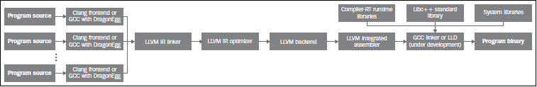

第3章 工具和设计
###############

　　LLVM项目由若干程序库和工具组成，它们一起构成一套宏大的编译器基础设施。细致的架构设计是连结这些组件的关键。然而，LLVM强调这样的哲学，即一切都是程序库，这样，只有相对少量的代码不是立即可重用的，也不是特定工具的一部分。大量工具让使用者能够通过命令行以多种方式练习程序库。在本章中，我将介绍以下内容：

* LLVM核心库设计概述
* 编译器驱动器如何工作
* 编译器驱动器之外：认识LLVM中间工具
* 如何写出第一个LLVM工具
* 浏览LLVM源代码的一般建议

LLVM的基本设计原则和它的历史
***************************

　　LLVM以其易于学习闻名于世，它的工具是高度组织的，让好奇的使用者能够观察到编译的很多步骤。这种设计决策可追溯到十多年前它的第1版，当时项目深度专注于后端算法，还依靠GCC将高级语言例如C翻译为LLVM中间表示（IR，Intermediate Representation）。今天，LLVM设计的核心正是它的IR。它使用静态单赋值形式（SSA），具有两个重要特征：

* 代码组织为三地址指令序列
* 寄存器数量无限制

　　然而，这并不意味着LLVM使用单一的程序表示方式。从整个编译过程来看，其它的中间数据结构也用于表达程序逻辑，在重要的阶段实现程序转换。从技术来说，它们也是程序的中间表示形式。举例来说，LLVM在编译的不同阶段还采用如下附加的数据结构：

* 在C或C++程序翻译为LLVM IR时，Clang用抽象语法树（AST）结构（TranslationUnitDecl class）表示驻留内存的程序。
* 在LLVM IR翻译为一种机器特定的汇编语言时，LLVM首先将程序变换为有向无环图（DAG）形式，让指令选择（SelectionDAG class）变得容易，然后将它变换回三地址指令表示，让指令调度（MachineFunction class）顺利进行。
* 为了实现汇编器和链接器，LLVM用第4种中间数据结构表示目标文件上下文中的程序。

　　LLVM中除了其它的程序表示形式，LLVM IR是最重要的一种。它不仅是一种驻留内存的表示，而且可以存储在磁盘上。这是它的特质。LLVM IR采用一种特定的编码方式存在于外部世界，这是项目初期的又一个重要决策，体现了当时人们研究程序终生优化的学术兴趣。

　　在这种哲学观念下，编译器超越编译时优化，去探索安装时、运行时、空闲时（当程序不在运行）的优化机会。以这种方式，优化贯穿程序的全部生命周期，由此解释了这个概念的名字。举例来说，当程序不在运行并且计算机空闲时，操作系统可以发起一个编译器守护进程，让它分析运行时收集的用户数据，为特定的使用情境重新优化程序。

　　注意，作为实现程序终生优化的关键，LLVM IR能够存储到磁盘，这提供了另一种编码整个程序的方法。当整个程序以一种编译器IR形式存储时，一系列新的非常有效的过程间（inter-procedural）优化是可能的，它们跨越单个翻译单元或者C文件的边界。如此，我们也能实现强大的链接时优化。

　　另一方面，在程序终生优化变得可行之前，程序需要以LLVM IR形式发布，这并没有实现。这大概暗示着，LLVM将成为一个平台或者虚拟机，和Java竞争，这也是一个巨大的挑战。例如，LLVM IR不是目标无关的，像Java那样。LLVM没有投资于强大的反馈导向的后安装时（post-installation time）优化。对于有兴趣了解这些技术挑战的细节的读者，我们建议阅读有益的LLVMdev邮件讨论会话：http://lists.cs.uiuc.edu/pipermail/llvmdev/2011-October/043719.html。

　　随着项目逐渐成熟，为了链接时优化的需要，编译器IR存储到磁盘的设计决策一直保持着，而略少关注程序终生优化的初始想法。终于，LLVM不再掩饰无意让其核心库成为一个平台，正式宣布放弃缩略词含义——低级虚拟机，而由于历史原因保留名字LLVM。

　　然而，存储到磁盘的表示形式自身应用前景广阔，包括链接时优化，若干团队正在努力将它应用到真实世界。例如，FreeBSD社区企图将程序的LLVM表示嵌入到程序可执行文件中，以实现安装时或者离线微架构优化。在这种情境下，尽管程序被编译为一般的x86可执行文件，举例来说，对于Intel Haswell x86处理器，LLVM编译器可以重新编译可执行文件中的LLVM表示，让它使用Haswell支持的新的专用指令。尽管这是一个目前正在评估的新想法，但是它展示出存储到磁盘的表示形式允许激进的方法。这种期望只是针对微架构优化的，因为在LLVM上实现如同Java的完全平台无关是不切实际的。目前仅有外部项目还在探索这个课题（见PNaCl，Chromium’s Portable Native Client）。

　　LLVM IR作为一种编译器IR，它的两个基本原则指导着核心库的开发：

* SSA表示和无限寄存器让优化能够快速执行。
* 整个程序的IR存储到磁盘让链接时优化易于实现。

理解如今的LLVM
***************

　　今天，LLVM项目发展为一个巨大的编译器相关的工具集合。实际上，名字LLVM可能表示如下含义：

* LLVM项目/基础设施：这是指若干项目的集合，一起构成一个完整的编译器：前端，后端，优化器，汇编器，链接器，libc++，compiler-rt，JIT引擎。举例来说，“LLVM是由若干项目组成的”，此句中的“LLVM”是这个含义。
* 基于LLVM的编译器：这是指部分或者完全地由LLVM基础设施构建的编译器。举例来说，一个编译器可能用LLVM作前端和后端，但是用GCC和GNU系统库执行最终链接。举例来说，“我用LLVM为MIPS平台编译C程序”，此句中的“LLVM”是这个含义。
* LLVM程序库：这是指LLVM基础设施的可重用代码部分。举例来说，“我的项目用LLVM的Just-in-Time编译框架生成代码”，此句中的“LLVM”是这个含义。
* LLVM核心：中间表示优化和后端算法构成LLVM核心，这是项目最初的起点。“LLVM和Clang是两个不同的项目”，此句中的“LLVM”是这个含义。
* LLVM IR：这是LLVM编译器的中间表示。“我开发了一个前端，将我自己的语言翻译为LLVM”，此句中的“LLVM”是这个含义。

　　为了理解LLVM项目，你需要明白基础设施的最重要的部分：

* 前端：这是一个编译阶段，它将计算机编程语言（例如C，C++，Objective-C）翻译为LLVM编译器IR。它包含词法分析器，语法解析器，语义分析器，和LLVM IR代码生成器。Clang项目实现了全部前端相关的步骤，同时提供了插件接口和一个单独的静态分析器工具，用于深度分析。想了解详情，你可翻阅第4章（前端）、第9章（Clang静态分析器）、第10章（Clang工具和LibTooling）。
* IR：LLVM IR既有人类可读形式，又有二进制编码形式。很多工具和程序库提供了用于构建、汇编、反汇编IR的接口。LLVM优化器也操作IR，大部分优化在此发生。我们在第5章（LLVM中间表示）详细解释IR。
* 后端：这是负责代码生成的编译阶段。它将LLVM IR变换为机器特定的汇编代码或目标代码二进制。寄存器分配、循环转换、窥孔优化、机器特定的优化/转换等属于后端。我们在第6章（后端）展开深入分析。

　　下图阐明了各个组件，展示了整个基础设施在一种具体应用配置下的概观。注意，我们可以组织安排各个组件，以一种不同的方式运用它们，例如，不使用LLVM IR链接器，假如我们不想探索链接时优化的话。

　　这些编译器组件之间以下面两种方式交互：

* 在内存中：这种方式通过一个总管工具（例如Clang）发生，每个LLVM组件都是它的程序库，根据分配在内存中的数据结构，将一个阶段的输出作为输入传送给下一个阶段。
* 通过文件：这种方式通过小型的独立工具发生，用户运行一个独立工具，它将一个特定组件的结果写到磁盘上的一个文件，接着用户运行下一个独立工具，它以这个文件为输入。

　　因此，高层工具（例如Clang）通过链接实现小工具的功能的程序库，可以吸收多个小工具的功能。这是成立的，因为LLVM的设计强调最大化地重用代码，代码成为程序库。而且，独立工具实体化少量的程序库是有益的，因为这使得用户能够通过命令行直接跟一个具体的LLVM组件交互。

　　例如，考虑下面的示意图。方框中工具的名字是粗体字体，用以实现工具功能的程序库的名字是常规字体，它们的方框是分开的。在这个例子中，LLVM后端工具，llc，用libLLVMCodeGen程序库实现它的部分功能，而运行纯粹LLVM IR层次优化器的opt命令，用另一个称为libLLVMipa的程序库实现目标无关的过程间优化。我们还看到clang，这个大型的工具同时用了这两个程序库，超越了llc和opt，为用户提供更简单的接口。因此，任何由这样的高层工具完成的任务，都可分解成一连串低层工具，达到相同的结果。实际上，Clang能够开展全部编译过程，而不仅仅是opt和llc的工作。这解释了为什么在静态编译下，Clang可执行文件经常是最大的，因为它链接并运行整个LLVM生态系统。

跟编译器驱动器交互
******************

　　编译器驱动器类似汉堡店里的店员，他跟你交互，确认你的订单，让后厨制作汉堡，然后将汉堡交付给你，或许附带可口可乐、番茄酱小袋等，如此完成你的订单。驱动器负责集成所有必需的程序库和工具，为用户提供友好的体验，让用户不必调用单体的编译器工具，例如前端、后端、汇编器、链接器等。每当你输入你的程序源代码，编译器驱动器就生成可执行文件。对于LLVM和Clang来说，编译器驱动器就是clang工具。

　　考虑简单的C程序，hello.c：

.. code-block:: c

    #include <stdio.h>

    int main() {
        printf("Hello, World!\n");
        return 0;
    }
	
　　为了生成这个简单程序的可执行文件，执行下面的命令：

.. code-block:: bash

    $ clang hello.c -o hello

.. note::

    参考第1章（编译和安装LLVM）中的说明，获得一份现成的LLVM。
　　
　　对于熟悉GCC的人，注意前面的命令和GCC命令非常相似。事实上，Clang编译器驱动器被设计成跟GCC的参数和命令结构相兼容，使得在很多项目中能够用LLVM代替GCC。对于Windows，Clang有一个称为clang-cl.exe的版本，它模仿Visual Studio C++编译器命令行接口。Clang编译器驱动器隐式地调用所有其它的工具，从前端到链接器。

　　为了看清楚驱动器编译你的程序时所调用的所有后续工具，使用-###命令行参数：

.. code-block:: bash

    $ clang -### hello.c -o hello
    clang version 3.4 (tags/RELEASE_34/final)
    Target: x86_64-apple-darwin11.4.2
    Thread model: posix
    "/bin/clang" -cc1 -triple x86_64-apple-macosx10.7.0 ... -main-file-name hello.c ... /examples/hello/hello.o -x c hello.c
    "/opt/local/bin/ld" ... -o hello /examples/hello/hello.o ...

　　Clang驱动器调用的第一个工具是clang本身，给以参数-cc1，关闭编译器驱动器模式而开启编译器模式。它还用了许多其它参数以调整C/C++选项。由于LLVM组件都是程序库，clang -cc1链接了IR生成器、目标机器代码生成器、汇编器等程序库。因此，解析源代码之后，clang -cc1自己能够调用其它的程序库，监督在内存中进行的编译流水线，直到生成目标文件。然后，Clang驱动器（不同于编译器clang -cc1）调用链接器，一个外部工具，以生成可执行文件，如前面的打印输出所示。它用系统链接器完成编译，因为LLVM链接器，lld，还在开发之中。

　　注意，编译发生在内存中比发生在磁盘上快得多，这使得中间编译文件失去魅力。这解释了为什么Clang（LLVM前端和接收输入的第一个工具）有责任将剩余的编译工作放在内存中进行，而不是将中间结果写到文件，再由后续工具读取它。

使用独立工具
************

　　我们可以利用LLVM独立工具来练习之前描述的编译流程，连接不同工具的输出。尽管这种做法让编译过程变慢，由于存储中间文件到磁盘，但是这种练习让人观察编译流水线，充满乐趣，富于教诲。这也让你能够微调中间工具的输入参数。列举部分工具如下：

* opt：这个工具致力于在IR层次优化程序。输入必须是一个LLVM bitcode（编码的LLVM IR）文件，生成的输出文件也是这种类型。
* llc：这个工具通过一个具体的后端将LLVM bitcode变换为目标机器汇编语言文件或目标文件。你可以通过参数选择优化级别，开启调试选项，开或者关目标特定的优化。
* llvm-mc：这个工具能够为多种目标格式（例如ELF、MachO、PE）汇编指令和生成目标文件。它也能够反汇编同样的目标，打印输出等价的汇编信息和内部LLVM机器指令数据结构。
* lli：这个工具为LLVM IR实现了解释器和JIT编译器。
* llvm-link：这个工具连接聚合若干LLVM bitcode，产生单个LLVM bitcode，容纳所有输入。
* llvm-as：这个工具将人类可读的LLVM IR文件，称为LLVM汇编，转换为LLVM bitcode。
* llvm-dis：这个工具解码LLVM bitcode，生成LLVM汇编。

　　让我们考虑一个简单的C程序，由多个函数组成，它们来自多个源文件。第一个源文件是main.c，代码如下：

.. code-block:: c

    #include <stdio.h>

    int sum(int x, int y);

    int main() {
        int r = sum(3, 4);
        printf("r = %d\n", r);
        return 0;
    }

　　第二个源文件是sum.c，代码如下：

.. code-block:: c

    int sum(int x, int y) {
        return x + y;
    }

　　我们可以用下面的命令编译这个C程序：

.. code-block:: bash

    $ clang main.c sum.c -o sum

　　然而，利用独立工具可以实现相同的结果。首先，用不同的参数调用clang，让它为C源文件生成LLVM bitcode，然后就此停止，而不是继续整个编译：

.. code-block:: bash
    $ clang -emit-llvm -c main.c -o main.bc
    $ clang -emit-llvm -c sum.c -o sum.bc
	
　　参数-emit-llvm让clang生成LLVM bitcode或LLVM汇编文件，依据输入的参数是-c还是-S。在这个的例子中，参数-emit-llvm和-c让clang生成LLVM bitcode格式的目标文件。用组合参数-flto -c得到相同的结果。如果想要生成LLVM汇编，它是人类可读的，用下面这对命令代替：

.. code-block:: bash

    $ clang -emit-llvm -S -c main.c -o main.ll
    $ clang -emit-llvm -S -c sum.c -o sum.ll

.. note::

    注意，不用参数-emit-llvm或-flto时，参数-c用目标机器语言生成目标文件，而参数-S生成目标汇编语言文件。这种行为是和GCC兼容的。
　　
　　这里.bc和.ll分别是LLVM bitcode和汇编文件的文件扩展名。为了继续编译，我们采用下面两种方式：

* 为每个LLVM bitcode生成目标特定的目标文件，用系统链接器链接它们以生成程序可执行文件（下图中的A部分）：

.. code-block:: bash

    $ llc -filetype=obj main.bc -o main.o
    $ llc -filetype=obj sum.bc -o sum.o
    $ clang main.o sum.o -o sum

* 首先，链接这两个LLVM bitcode为一个最终的LLVM bitcode。然后，为这个最终的bitcode生成目标特定的目标文件，通过调用系统链接器生成程序可执行文件（下图中的B部分）：

.. code-block:: bash

    $ llvm-link main.bc sum.bc -o sum.linked.bc
    $ llc -filetype=obj sum.linked.bc -o sum.linked.o
    $ clang sum.linked.o -o sum

　　参数-filetype=obj指定输出目标文件，而不是输出目标汇编文件。我们利用Clang驱动器，clang，来调用链接器。然而这个系统链接器可以被直接调用，假如你知道你的系统链接器链接系统库所需要的所有参数。

　　调用后端（llc）之前链接IR文件，使得opt工具提供的链接时优化（例子见第5章，LLVM中间表示）能够进一步优化最终产生的IR。作为替代，llc工具能够生成汇编输出，可以利用llvm-mc进一步汇编它。我们在第6章（后端）说明这种接口的详细内容。

探究LLVM内部设计
****************

　　为了解耦编译器使之成为若干工具，LLVM设计典型地强调，组件之间的交互发生在高层次抽象。将不同的组件隔离为单独的程序库。用C++写成，使用面向对象范式，提供插件式的Pass接口，让它易于在整个编译流水线中集成转换和优化。

了解LLVM基础库
==============

　　LLVM和Clang逻辑被精心地组织成如下的程序库：

* libLLVMCore：包含所以LLVM IR相关的逻辑：IR构造（数据布局、指令、基本块、函数）和IR验证。它也提供Pass管理器。
* libLLVMAnalysis：包含若干IR分析Pass，例如别名分析、依赖分析、常量合并、循环信息、内存依赖分析、指令简化等。
* libLLVMCodeGen：实现了目标无关的代码生成和机器层次（低层版本LLVM IR）的分析和转换。
* libLLVMTarget：通过通用目标抽象，提供对目标机器信息的访问。libLLVMCodeGen实现了通用后端算法，目标特定的逻辑留给了即将介绍的下一个库，而高层抽象为两者提供了交流的通道。
* libLLVMX86CodeGen：包含x86目标特定的代码生成信息、转换和分析Pass，它们组成了x86后端。注意，每个机器目标都有自己不同的库，例如LLVMARMCodeGen和LLVMMipsCodeGen，分别实现了ARM和MIPS后端。
* libLLVMSupport：包含一组常用的实用工具。错误处理、整数和浮点数处理、命令行解析、调试、文件支持、字符串操作，这些是这个库实现的算法的例子，LLVM的各个组件到处都在使用它们。
* libclang：它实现一套C接口（对比C++，LLVM代码的默认实现语言）以暴露Clang的前端功能——诊断报告、AST遍历、代码补全、光标和源代码间映射。C接口相当简单，使得采用其它语言（例如Python）的项目能够容易地使用Clang的功能，尽管用C设计接口是为了更稳定，并让外部项目能够利用它。它仅覆盖内部LLVM组件所用的C++接口的子集。
* libclangDriver：它包含一套C++类，编译器驱动器利用它们理解类GCC的命令行参数，以准备编译任务，为外部工具组织适当的参数，以完成编译的不同步骤。根据目标平台，它可以采用不同的编译策略。
* libclangAnalysis：这是一系列Clang提供的前端层次分析。它的特性诸如构造CFG和调用图、可达代码、安全格式化字符串，等等。

　　作为一个例子说明如何用这些库构建LLVM工具，下图展示了llc工具对libLLVMCodeGen、libLLVMTarget和其它库的依赖，以及这些库对其它库的依赖。注意，上述列表还不完全。

　　此处是LLVM程序库概览，省略的库留到后续章节介绍。对于版本3.0，LLVM团队写了一份好的文档，说明所有LLVM库之间的依赖关系。尽管文档已经过时，它仍然是一份针对程序库组织的有趣的概述。文档页面：http://releases.llvm.org/3.0/docs/UsingLibraries.html

介绍LLVM中的C++实践
+++++++++++++++++++

　　LLVM的程序库和工具用C++写成，以利用面向对象的编程范式，加强各个部分之间的互操作性。另外，为了尽可能地消除低效率代码，强制实行良好的C++编程实践。

多态实践
--------

　　通过在基类中实现通用代码生成算法，继承和多态方法抽象了不同后端共同的任务。以这种设计，每个具体的后端可以专注于实现它的特性，通过编写少量必需的函数以覆盖超类的通用操作。libLLVMCodeGen包含共同的算法，libLLVMTarget包含抽象个体机器的接口。下面的代码片段（源自llvm/lib/Target/Mips/MipsTargetMachine.h）演示了MIPS目标机器的描述类是如何声明为LLVMTargetMachine类的子类的，阐明了这种概念。此代码是LLVMMipsCodeGen程序库的一部分：

.. code-block:: cpp

    class MipsTargetMachine : public LLVMTargetMachine {
        MipsSubtarget Subtarget;
        const DataLayout DL;
    ...

　　为了进一步阐明这种设计理念，我们展示另一个后端的例子，在这个例子中，目标无关的寄存器分配器（它是所有后端共同的）需要知道那些寄存器是保留而不能用以分配的。此信息依赖于具体的目标，不能在通用的超类中确定。这通过调用函数MachineRegisterInfo::getReservedRegs()确定，每个目标必须重写这个通用方法。下面的代码片段（源自llvm/lib/Target/Sparc/SparcRegisterInfo.cpp）演示了SPARC目标如何重写这个方法：

.. code-block:: cpp

    BitVector SparcRegisterInfo::getReservedRegs(...) const {
        BitVector Reserved(getNumRegs());
        Reserved.set(SP::G1);
        Reserved.set(SP::G2);
    ...

　　此代码中，通过给出一个位向量，SPARC后端个别地选定了哪些寄存器不能用以通用寄存器分配。

介绍LLVM中的C++模板
-------------------

　　LLVM常常使用C++模板，尽管特别谨慎以控制编译时间，这是滥用模板的C++项目的典型特征。在任何可能的时候应用模板特化，实施快速的循环利用的通用任务。作为一个LLVM代码中的模板例子，这里介绍一个函数，它检查作为参数传入的一个整数是否能用给定长度的位表示，这个长度是模板参数（源自llvm/include/llvm/Support/MathExtras.h）：

.. code-block:: cpp

    template<unsigned N>
    inline bool isInt(int64_t x) {
        return N >= 64 || (-(INT64_C(1)<<(N-1)) <= x && x < (INT64_C(1)<<(N-1)));
    }

　　此代码中，注意模板代码如何处理任意的位长度值N。先作一次比较，当位长度大于64时返回真。如果不是，计算两个表达式，它们分别是这个位长度的上界和下界，检查x是否在它们之间。将此代码和下面的模板特化比较，这是为常用的8位长度生成更快的代码的：

.. code-block:: cpp

    template<>
    inline bool isInt<8>(int64_t x) {
      return static_cast<int8_t>(x) == x;
    }

　　此代码将比较次数从三次降到两次，因而是一种正当的特化。

在LLVM中强制最好的C++实践
------------------------

　　编程时常常无意地产生bug，区别在于如何控制你的bug。LLVM的哲学建议你在任何可能的时候使用libLLVMSupport实现的断言机制。注意，调试编译器是特别困难的，因为编译的产物是一个不同的程序。因此，如果能够更早地发现古怪的行为，在输出变得复杂之前，复杂到不容易确定它是否正确，你将节省很多时间。例如，我们来看一个ARM后端Pass的代码，它修改常量pools的布局，重新分配它们，遍布若干较小的pools“岛屿”，遍布一个函数。ARM程序常常采用这种策略加载大型常量，针对受限的PC相对寻址机制，因为单个大型的pool被置于一个距离指令太远的位置以致指令无法访问它。代码位于llvm/lib/Target/ARM/ARMConstantIslandPass.cpp，下面是它的摘录：

.. code-block:: cpp

    const DataLayout &TD = *MF->getTarget().getDataLayout();
    for (unsigned i = 0, e = CPs.size(); i != e; ++i) {
        unsigned Size = TD.getTypeAllocSize(CPs[i].getType());
        assert(Size >= 4 && "Too small constant pool entry");
        unsigned Align = CPs[i].getAlignment();
        assert(isPowerOf2_32(Align) && "Invalid alignment");
        // Verify that all constant pool entries are a multiple of their alignment.
        // If not, we would have to pad them out so that instructions stay aligned.
        assert((Size % Align) == 0 && "CP Entry not multiple of 4 bytes!");

　　此代码遍历一个代表ARM常量pools的数据结构，程序员期望这个对象的每个字段遵从特定的约束。注意程序员如何控制数据语义，通过使用assert调用。如果发生了不同于编写代码时的期望的事情，程序会立即停止执行，并打印失败的断言信息。程序员使用布尔表达式&&“错误原因”的句式，这不会干扰assert布尔表达式的估值，反而会给出关于断言失败的简短文字解释，当这个表达式由于失败事件被打印时。使用assert会影响性能，当LLVM项目以release编译时，这种影响被完全消除，因为断言被关闭了。

　　在LLVM中你将频繁看到的另一种常用实践是运用智能指针。一旦变量生命期终结，智能指针自动释放内存，举例来说，LLVM代码用它们存放目标信息和模块（module）。过去，LLVM提供了一种特殊的智能指针类，称为OwningPtr，在llvm/include/llvm/ADT/OwningPtr.h中定义。自LLVM3.5起，这个类被弃用，代之以C++11标准提出的std::unique_ptr()。

　　如果你有兴趣了解LLVM项目采用的C++最好实践的完整列表，查阅 http://llvm.org/docs/CodingStandards.html 。每个C++程序员值得一读。

在LLVM中让字符串引用轻量化
-------------------------

　　LLVM项目有大量的数据结构程序库，支持常见的算法，而字符串在LLVM程序库中占据特殊的位置。C++中的字符串是人们激烈讨论的对象：什么时候我们该用简单的char *，相对C++标准库的string类？为了在LLVM上下文中讨论这个问题，考虑LLVM程序库到处密集地使用字符串引用，以引用LLVM模块的名字、函数的名字、值的名字，等等。有些时候，字符串LLVM句柄包含null字符，致使以const char*指针传递常量字符串引用的方法是行不通的，因为null字符终结C类型的字符串。另一方面，使用const std::string&会频繁地引起额外的堆内存分配，因为string类需要拥有字符缓冲区。在下面的例子中我们会看到以上问题：

.. code-block:: cpp

    bool hasComma(const std::string &a) {
        // code
    }
    void myfunc() {
        char buffer[40];
        // code to create our string in our own buffer
        hasComma(buffer); // C++ compiler is forced to create a new string object, duplicating the buffer
        hasComma("hello, world!"); // Likewise
    }

　　注意我们每次试图在自己的缓冲区创建一个字符串时，我们将付出额外的堆内存分配以复制字符串到string对象的内部缓冲区，它必须拥有自己的缓冲区。第一种情况，字符串分配在栈上；第二种情况，字符串是一个全局常量。对于这些情况，C++缺少一个简单的类，当我们仅仅需要引用一个字符串时，它能够避免不必要的分配。尽管我们严格地对待string对象，消除不必要的堆内存分配，引用一个字符串对象意味着两次间接访问。因为string类已经用一个内部指针存放它的数据，传递一个string对象的指针带来了双引用的额外开销，当我们访问实际的数据时。

　　我们可以使用一个LLVM类以更加高效地处理字符串引用：StringRef。这是一个轻量的类，可以如同const char*那样以值传递，但是它记录字符串的长度，允许null字符。然而，相比string对象，它不拥有缓冲区，因而从不分配堆内存空间，仅仅引用存在于外部的一个字符串。其它C++项目也在探索这种思想：例如Chromium，用StringPiece类实现了相同的想法。

　　LLVM还设计了另一个字符串操作类。LLVM提供Twine类，用以通过若干串联构建新的字符串。它延迟实际的串联，通过仅记录若干字符串的引用，它们将组成最终的产物。这是在前C++11时期设计的，当时字符串串联的代价高。

　　如果你有兴趣找出LLVM提供给它的编程者的其它通用类，你的书签值得收藏一份非常重要的文档，就是LLVM编程者手册，手册讨论所有LLVM通用数据结构，它们对一般编程都是有益的。此手册位于 http://llvm.org/docs/ProgrammersManual.html 。

演示插件式Pass接口
==================

　　Pass是一种转换分析或优化。通过LLVM API你可轻松注册任意Pass，在程序编译生命期的不同阶段，这是LLVM设计值得赞许的地方。Pass管理器用以注册Pass、调度Pass、声明Pass之间的依赖关系。因此，不同的编译阶段到处都可获得PassManager类的实例。

　　举例来说，目标可自由地在代码生成的若干位置应用定制的优化，例如寄存器分配之前之后，或者汇编输出之前。为了阐明这个问题，我们展示一个X86目标的例子，它有条件地在汇编输出之前注册一对定制的Pass（源自lib/Target/X86/X86TargetMachine.cpp）：

.. code-block:: cpp

    bool X86PassConfig::addPreEmitPass() {
      ...
      if (getOptLevel() != CodeGenOpt::None && getX86Subtarget().hasSSE2()) {
        addPass(createExecutionDependencyFixPass(&X86::VR128RegClass));
        ...
      }
    
      if (getOptLevel() != CodeGenOpt::None &&
          getX86Subtarget().padShortFunctions()) {
        addPass(createX86PadShortFunctions());
        ...
      }
      ...

　　注意后端如何根据具体的目标信息决定是否添加某个Pass。在添加第一个Pass之前，X86目标检查是否支持SSE2多媒体扩展。对于第二个Pass，检查是否特别地要求填充。

　　下图中的A部分举例说明了在opt工具中优化Pass是如何被插入的；B部分说明了代码生成阶段的几个目标挂钩函数，用于插入定制的目标优化。注意插入点分布于不同的代码生成阶段。当你第一次编写Pass需要决定在何处运行时，这张图是特别有用的。第5章（LLVM中间表示）将详细描述PassManager接口。

编写第一个LLVM项目
******************

　　在本节中，我们将演示如何用LLVM程序库编写你的第一个项目。在前面的章节中，我们介绍了如何用LLVM工具为程序产生相应的中间语言文件，即bitcode文件。现在我们将创建一个程序，它读入bitcode文件，打印程序定义的函数的名字，函数的基本块数量，展示使用LLVM程序库是多么容易。

编写Makefile
=============

　　链接LLVM程序库要编写很长的命令行，不借助编译系统，这是不现实的。在下面的代码中，我们展示一个Makefile用以完成上述工作，它基于DragonEgg所用的Makefile，我们一边呈现一边解释各个部分。如果你复制粘贴此代码，会丢失tab字符；记住Makefile依靠tab字符指定定义规则的命令。因此，你应该手动地输入它们：

.. code-block:: bash

    LLVM_CONFIG?=llvm-config
    
    ifndef VERBOSE
    QUIET:=@
    endif
    
    SRC_DIR?=$(PWD)
    LDFLAGS+=$(shell $(LLVM_CONFIG) --ldflags)
    COMMON_FLAGS=-Wall -Wextra
    CXXFLAGS+=$(COMMON_FLAGS) $(shell $(LLVM_CONFIG) --cxxflags)
    CPPFLAGS+=$(shell $(LLVM_CONFIG) --cppflags) -I$(SRC_DIR)

　　这第一部分定义了若干Makefile变量，用作编译选项。第一个变量决定llvm-config程序的位置。对于这种情况，它需要在你的执行路径中。llvm-config工具是一个LLVM程序，打印各种各样有用的信息，用以构建需要链接LLVM程序库的外部项目。

　　举例来说，在定义用于C++编译器的一系列选项时，注意我们请求Make运行llvm-config --cxxflags shell命令，让它打印用于编译LLVM项目的一系列选项。以这种方式，我们让项目源代码的编译和LLVM源代码兼容。最后的变量定义的一系列选项将传送给编译器预处理器。

.. code-block:: bash

    HELLO=helloworld
    HELLO_OBJECTS=hello.o
    default: $(HELLO)
    
    %.o : $(SRC_DIR)/%.cpp
    　　@echo Compiling $*.cpp
    　　$(QUIET)$(CXX) -c $(CPPFLAGS) $(CXXFLAGS) $<
    
    $(HELLO) : $(HELLO_OBJECTS)
    　　@echo Linking $@ $(CXXFLAGS) $(LDFLAGS) $^ `$(LLVM_CONFIG) --libs bitreader core support`

　　这第二部分定义了Makefile规则。第一条规则总是默认规则，我们将它关联为编译我们的hello-world可执行文件。第二条规则是通用规则，将所有C++文件编译为目标文件。我们传给它预处理选项和C++编译器选项。我们用$(QUIET)变量关闭全部窗口命令行输出，但是如果你想要冗长的编译日志，可以在运行GNU Make时定义VERBOSE。

　　最后的规则链接所有的目标文件（此处只有一个），链接LLVM程序库，生成我们的项目可执行文件。这部分有链接器完成，但是有些C++选项可能会起作用。因此，将C++和链接器选项都传递给命令行。这由`命令`句式完成，它指示shell用`命令`的输出替代此部分。在我们的例子中，命令是llvm-config --libs bitreader core support。--libs选项要求llvm-config为我们提供链接器选项清单，用以链接所要求的LLVM程序库。这里，我们要求链接libLLVMBitReader、libLLVMCore、libLLVMSupport。

　　llvm-config返回的选项清单是一系列-l链接器参数，如-lLLVMCore -lLLVMSupport。然而注意，传给链接器的参数顺序是有关系的，要求将依赖于其它库的库排在前面。例如，由于libLLVMCore使用libLLVMSupport提供的通用功能，正确的顺序是-lLLVMCore -lLLVMSupport。

　　顺序之所以有关系，是因为程序库是目标文件的集合，当链接一个项目和一个库时，链接器只会选择能够解决已知未定义符号的那些目标文件。因此，如果在处理命令行参数中的最后一个库时，发现它引用前面已经处理过的库中的符号，大多数链接器（包括GNU ld）都不会回过头去添加可能遗漏的目标文件，导致编译失败。

　　如果你不想担此责任，强制链接器迭代地访问每个库，直到包含所有需要的目标文件，你必须在程序库清单的开头和结尾使用选项--start-group和--end-group，但是这会减慢链接速度。为了摆脱这种烦恼，即构建整个依赖关系图以确定链接器参数的顺序，你可以简单地调用llvm-config --libs，让它为你代劳，如前面所做的那样。

　　Makefile的最后一个部分定义清理规则，以删除所有编译器生成的文件，重新从头开始编译。清理规则是这样写的：

.. code-block:: bash

    clean:
    　　$(QUIET)rm -f $(HELLO) $(HELLO_OBJECTS)

编写代码
=========

　　我们将完整地给出一个Pass的代码。代码相对较短，因为它建立在LLVM Pass基础设施之上，后者为我们做了大部分工作。

.. code-block:: cpp

    #include "llvm/Bitcode/ReaderWriter.h"
    #include "llvm/IR/Function.h"
    #include "llvm/IR/Module.h"
    #include "llvm/Support/CommandLine.h"
    #include "llvm/Support/MemoryBuffer.h"
    #include "llvm/Support/raw_os_ostream.h"
    #include "llvm/Support/system_error.h"
    #include <iostream>
    
    using namespace llvm;
    
    static cl::opt<std::string> FileName(cl::Positional, cl::desc("Bitcode file"), cl::Required);
    
    int main(int argc, char** argv) {
        cl::ParseCommandLineOptions(argc, argv, "LLVM hello world\n");
        LLVMContext context;
        std::string error;
        OwningPtr<MemoryBuffer> mb;
        MemoryBuffer::getFile(FileName, mb);
        Module *m = ParseBitcodeFile(mb.get(), context, &error);
        if (m==0) {
            std::cerr << "Error reading bitcode: " << error << std::end;
            return -1;
        }
        raw_os_ostream O(std::cout);
        for (Module::const_iterator i = m->getFunctionList().begin(),
          e = m->getFunctionList().end(); i != e; ++i) {
            if (!i->isDeclaration()) {
                O << i->getName() << " has " << i->size() << " basic block(s).\n";
            }
        }
        return 0;
    }

　　我们的程序利用LLVM cl名字空间的工具（cl代表command line）来实现命令行接口。调用函数ParseCommandLineOptions，声明一个全局变量，它的类型是cl::opt<std::string>，以此说明我们的程序接收单个参数，它的类型是string，存放bitcode文件名。

　　然后，实例化一个LLVMContext对象，以存放一次LLVM编译的从属数据，使得LLVM线程安全。MemoryBuffer类为内存块定义了只读的接口。parseBitcodeFile函数利用它读取输入文件的内容，解析文件中的LLVM IR。在执行错误检查确信一切完好之后，遍历文件中模块的所有函数。LLVM模块的概念类似于一个翻译单元，包含bitcode文件所编码的一切内容，作为LLVM层级的顶端实体，下属若干函数，然后基本块，最后指令。如果函数只是一个声明，我们忽略它，因为我们想检验函数的定义。当我们找到函数定义时，我们打印它们的名字，以及所含基本块的数量。

　　程序编译之后，以参数-help运行它，看一看已经为你的程序准备好的LLVM命令行功能。然后，找一个你想变换为LLVM IR的C或C++文件，变换，再用你的程序分析。

.. code-block:: bash

    $ clang -c -emit-llvm mysource.c -o mysource.bc
    $ helloworld mysource.bc

　　如果你想进一步探索函数中可提取的内容，参考LLVM关于llvm::Function类的doxygen文档：http://llvm.org/docs/doxygen/html/classllvm_1_1Function.html。作为练习，尝试扩展这个例子，打印每个函数的参数清单。

浏览LLVM源代码—一般建议
***********************

　　在继续学习更多的LLVM代码之前，有必要理解若干观点，主要对于开源软件世界的新手编程者。如果你在一个公司内部的闭源项目中工作，你可能从同事编程者处得到很多帮助，他们加入项目的时间比你早，对很多设计决定有深入的理解，这些起初对你来说是晦涩的。如果你遇到问题，组件的作者可能愿意口头给你解释。口头解释的效能很高，因为他一边解释，一边甚至能够读懂你的面部表情，看出你不理解的地方，为你调整话语，给出一种定制的解释。

　　然而，远程工作的时候，如大多数社区项目那样，不能会面，口头交流很少。因此，开源社区愈加鼓励人们写作有力的文档。另一方面，文档可能并不是大多数人通常的期望，如一份英语写作的文档，清楚地陈述了所有设计决定。文档很大程度上是代码本身，在这种意义上，为了让他人没有英语文档也能够理解代码的意图，编程者有责任写出清晰的代码。

理解代码如文档
=============

　　尽管LLVM的最重要部分都有英语文档，在本书中我们到处引用它们，我们最终的目标是让你准备好直接阅读代码，因为这是深入探索LLVM基础设施的前提。我们向你介绍基础的概念，这是理解LLVM如何工作所必需的，有了它们，你会发现理解LLVM代码所带来的乐趣，无需阅读英语文档，或者能够阅读很多没有任何英语文档的LLVM的部分。尽管这充满挑战，当你开始实践，你将在内心感官上深化对项目的理解，更有信心去修改它。不知不觉地，你将成为一个掌握LLVM本质高级知识的编程者，帮助邮件列表中的其他人。

向社区求助
==========

　　邮件列表提醒着你不是孤单的。Clang前端的邮件列表是cfe-dev，LLVM核心库的邮件列表是llvmdev。在下面的地址花点时间订阅它们：

* Clang前端开发者列表（http://lists.llvm.org/mailman/listinfo/cfe-dev）
* LLVM核心开发者列表（http://lists.llvm.org/mailman/listinfo/llvm-dev）

　　为项目工作的人很多，有的正在尝试着实现你也感兴趣的东西。因此，很有可能，你想问的问题，其他人已经处理过了。

　　在寻求帮助之前，最好演练一下你的思路，尝试独自修改代码。看看依靠自己你能走多远，尽你可能进化你的知识。当你遇到迷惑你的问题时，向邮件列表写个邮件，写清楚在征求帮助之前你已经调查过的事情。依照这些指南，你极有可能得到针对你的问题的最好回答。

处理更新—SVN日志用作文档
========================

　　LLVM项目时常地在变化，你更新LLVM版本之后，可能你的软件不能工作了，它与LLVM程序库交互。这是十分常见的处境。在你重新阅读代码以了解它如何变化之前，查看代码修改日志是有益的。
　　为了在实践中了解这是怎么工作的，我们来练习将Clang前端从3.4更新到3.5。假设你为静态分析器写了一段代码，实例化一个BugType对象：
BugType *bugType = new BugType("This is a bug name", "This is a bug category name");

　　这个对象用于让你自己的检查器（细节见第9章，Clang静态分析器）报告某种bug。现在，让我们将整个LLVM和Clang代码树更新到版本3.5，然后编译以上代码。我们得到以下输出：

.. code-block:: bash

    error: no matching constructor for initialization of 'clang::ento::BugType' BugType *bugType = new BugType("This is a bug name",
                           ^
    ~~~~~~~~~~~~

　　出现这个错误，是因为BugType构造器从一个版本变到了另一个。如果你弄不清楚怎么调整你的代码，你需要阅读修改日志，这是重要的文档，它陈述某段时间内的代码改动。幸运的是，对于采用代码修改系统的开源项目，通过查询代码修改服务器，我们可以轻松地得到作用一个具体文件的提交的消息。对于LLVM，你甚至可以用浏览器通过ViewVC查询：http://llvm.org/viewvc。

　　在此例中，我们想看一看定义这个构造器方法的头文件发生什么变化。查看LLVM源代码树，找到文件include/clang/StaticAnalyzer/Core/BugReporter/BugType.h。

.. note::

    如果你在用文本模式的编辑器，一定用工具导航LLVM源代码。比如，花一点时间看看如何在你的编辑器中使用CTAGS。你将轻易地在LLVM源代码树中找到定义你所感兴趣的类的每个文件。如果你固执地不想用CTAGS或其它工具（例如Visual Studio的IntelliSense或Xcode），帮助你导航大型C/C++项目，你总是可以运用一个命令，例如grep -re "keyword" *，在项目的根目录中执行它，以列出所有包含此关键词的文件。通过使用智能关键词，你可以轻易地找到定义文件。

　　为了查看作用这个具体的头文件的提交消息，我们访问 http://llvm.org/viewvc/llvm-project/cfe/trunk/include/clang/StaticAnalyzer/Core/BugReporter/BugType.h?view=log ，它在浏览器中打印出日志。现在，我们看到一次具体的修订，发生在写作此书三个月之前，当时LLVM更新到v3.5：

.. code-block:: bash

    Revision 201186 - (view) (download) (annotate) - [select for diffs] 
    Modified Tue Feb 11 15:49:21 2014 CST (3 months, 1 week ago) by alexfh
    File length: 2618 byte(s)
    Diff to previous 198686
    
    Expose the name of the checker producing each diagnostic message.
    
    Summary:
    In clang-tidy we'd like to know the name of the checker producing each
    diagnostic message. PathDiagnostic has BugType and Category fields, which are
    both arbitrary human-readable strings, but we need to know the exact name of the
    checker in the form that can be used in the CheckersControlList option to
    enable/disable the specific checker.
    
    This patch adds the CheckName field to the CheckerBase class, and sets it in
    the CheckerManager::registerChecker() method, which gets them from the
    CheckerRegistry.

    Checkers that implement multiple checks have to store the names of each check
    in the respective registerXXXChecker method.
    
    Reviewers: jordan_rose, krememek
    Reviewed By: jordan_rose
    CC: cfe-commits
    Differential Revision: http://llvm-reviews.chandlerc.com/D2557

　　这个提交消息是非常透彻的，解释了修改BugType构造器的全部原因：之前用两个字符串实例化这个对象，这不足以知道哪个检查器发现了一个具体的bug。因此，现在你必须通过传递你的检查器对象的一个实例来实例化对象，它将被存储在BugType对象中，使得易于发现哪个检查器产生了每个bug。

　　现在，我们修改代码，以遵照下面更新后的接口。我们假设这段代码作为Checker类的一个成员函数的部分运行，如通常实现静态分析器检查器那样。因此，this关键词应该返回一个Checker对象：

.. code-block:: bash

    BugType *bugType = new BugType(this, "This is a bug name", "This is a bug category name");

结束语
======

　　当你听说LLVM项目文档详实的时候，不要期望找到这样的英文网页，它精确地描述了每个位和代码片段。这意味着，当你阅读代码、接口、注释、提交消息的时候，你将能够不断深入地理解LLVM项目，让自己知悉最新的变化。不要忘记练习修改源代码，发现它是怎么运作的，这意味着你需要你的CTAGS作好探索的准备。

总结
*****

　　在本章中，我们从历史的视角向你介绍了LLVM项目采用的设计决策，概述了若干最重要的组成部分。我们还演示了如何以两种不同的方式使用LLVM组件。第一，通过使用编译器驱动器，它作为一种高层工具以单个命令为你执行整个编译过程。第二，通过使用单独的LLVM独立工具。除了存储中间结果到磁盘，这降低了编译速度，这些工具通过命令行让我们能够与LLVM程序库的特定部分交互，更精细地控制编译过程。这是学习LLVM如何工作的卓越的方法。我们还介绍了一些LLVM用到的C++编码风格，解释了你该如何面对LLVM代码文档，以及如何向社区求助。

　　在下一章，我们将详细介绍Clang前端的实现和它的程序库。

