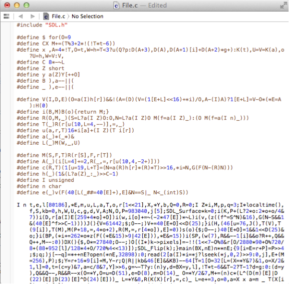
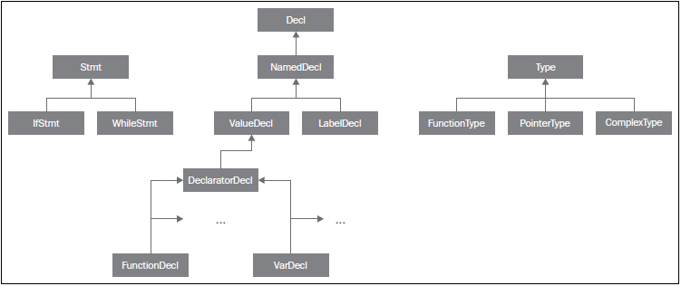
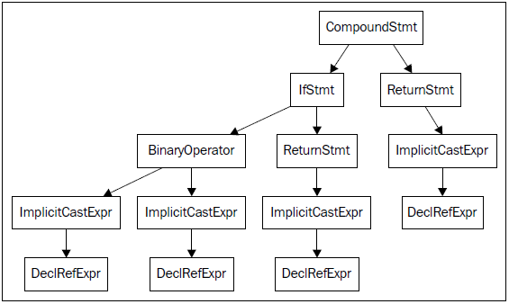

第4章 前端
###########

　　编译器前端将源代码变换为编译器的中间表示，它处于代码生成之前，后者是针对具体目标的。因为编程语言有独特的语法和语义的域，所以通常来说，前端只处理一种语言或者一组类似的语言。比如Clang，处理C、C++、objective-C源代码。在本章中，我们将介绍以下内容：

* 程序如何链接Clang程序库，如何使用libclang
* Clang诊断和Clang前端阶段
* 词法、语法、语义分析和libclang的例子
* 如何利用C++ Clang库编写一个简单的编译器驱动器

介绍Clang
**********

　　Clang项目被认为是C、C++、Objective-C官方的LLVM前端。Clang的官方网站是http://clang.llvm.org，我们在第1章，编译和安装LLVM，介绍了Clang的配置、编译和安装。

　　名字LLVM令人困惑，由于它含义多样。类似地，Clang可能指代三种不同的实体：

1. 前端（由Clang程序库实现）。
2. 编译器驱动器（由clang命令和Clang驱动器程序库实现）。
3. 实际的编译器（由clang -cc1命令实现）。clang -cc1中的编译器不单用Clang程序库实现，还大量地用到了LLVM程序库以实现编译器的中端和后端，还有集成的汇编器。

　　在本章中，我们重点讨论Clang程序库和LLVM C家族前端。

　　为了理解驱动器和编译器如何工作，我们从分析clang编译器驱动器的命令行开始。

.. code-block:: bash

    $ clang hello.c -o hello

　　在解析命令行参数之后，Clang驱动器通过衍生自身的另一个实例，以-cc1选项调用内部的编译器。在编译器驱动器中使用-Xclang <option>，你可以向这个工具输入具体的参数，这不受到模仿GCC命令行接口的约束，不像驱动器。例如，clang -cc1工具有一个特殊的选项，可打印Clang抽象语法树（AST）。你可以用下面的命令结构激活这个功能：

.. code-block:: bash

    $ clang -Xclang -ast-dump hello.c

　　你也可以直接调用clang -cc1而不是驱动器：

.. code-block:: bash

    $ clang -cc1 -ast-dump hello.c

　　然而，记住编译器驱动器的任务之一是为调用编译器准备所有必需的参数。用选项-###运行驱动器，可看到它用什么参数去调用clang -cc1编译器。例如，如果你手动地调用clang -cc1，你也需要自己指定所有系统头文件的位置，通过-I选项。

前端的活动
===========

　　clang -cc1工具的一个重要方面（困惑的源头）是，它不仅实现了编译器前端，而且利用LLVM程序库，构建了编译所必需的所有其它LLVM组件，直到LLVM能够处理为止。因此，它几乎实现了完整的编译器。典型地，对于X86目标，clang -cc1在生成目标文件之后就中止了，因为LLVM链接器还在实验中，还没有集成进来。在这个时候，它将控制权让渡回驱动器，后者将调用外部工具以链接项目。选项-###会显示Clang驱动器所调用的程序清单，示例如下：

.. code-block:: bash

    $ clang hello.c -###
    clang version 3.4
    (tags/RELEASE_34/final 211335)
    Target: i386-pc-linux-gnu
    Thread model: posix
     "clang" "-cc1" (...parameters) "hello.c" "-o" "/tmp/hello-ddafc1.o"
     "/usr/bin/ld" (...parameters) "/tmp/hello-ddafc1.o" "-o" "hello"

　　我们省略了驱动器所用的完整参数清单。第一行显示clang -cc1从C源文件开始编译，直到生成目标文件。然后，第二行显示Clang仍然依赖系统链接器来完成编译。

　　从内部来说，每次clang -cc1调用都是由一种主要前端活动来控制的。完整的活动集合的定义在源文件include/clang/Frontend/FrontendOptions.h中。下表列出了一些例子，描述了clang -cc1可能执行的不同的任务：

============ ========================================
活动          描述
============ ========================================
ASTView       解析抽象语法树并用Graphviz显示
EmitBC        输出LLVM bitcode .bc文件
EmitObj       输出目标特定的.o文件
FixIt         解析并应用所有fixit到源代码
PluginAction  运行一个插件活动
RunAnalysis   运行一次或多次源代码分析
============ ========================================
　　选项-cc1触发cc1_main函数的执行（详情参见源代码文件tools/driver/cc1_main.cpp）。例如，当通过clang hello.c -o hello间接地调用-cc1时，这个函数初始化目标特定的信息，建立诊断基础设施，执行EmitObj活动。这个活动由CodeGenAction实现，FrontendAction的一个子类。此代码会实例化所有Clang和LLVM组件，指挥它们生成目标文件。

　　不同前端活动的共存，让Clang能够为了编译以外的目的运行编译管线，例如静态分析。还有，你可以通过-target命令行参数为clang指定目标，根据这个目标，它将加载不同的ToolChain对象。这会改变哪些任务应该由-cc1执行，通过执行不同的前端活动，也会改变哪些任务应该由外部工具执行，使用哪些外部工具。例如，某个目标可能使用GNU汇编器和GNU链接器以完成编译，而另一个可能使用LLVM集成的汇编器和GNU链接器。如果你不清楚Clang为你的目标在使用了哪些外部工具，你总是可以借助-###选项打印驱动器命令。我们在第8章，交叉平台编译，对不同的目标作了更多的讨论。

程序库
========

　　自此以后，我们会将Clang视作一套程序库——它们实现了一个编译器前端，而不是驱动器和编译器应用程序。在这个意义上，Clang是模块化设计的，由若干程序库组成。libclang（http://clang.llvm.org/doxygen/group__CINDEX.html）是为外部Clang用户设计的最重要的接口，它通过C API提供了大量的前端功能。它包含若干Clang程序库，也可以单独使用它们，跟你的项目链接在一起。下面为本章列出最相关的程序库：

    * libclangLex：这个库用于预处理和词法分析，处理宏、标记、pragma构造
    * libclangAST：这个库提供编译、操作、遍历抽象语法树的功能
    * libclangParse：这个库用于解析程序逻辑，利用词法阶段的结果
    * libclangSema：这个库用于语义分析，为AST验证提供动作
    * libclangCodeGen：这个库利用目标特定信息进行LLVM IR代码生成
    * libclangAnalysis：这个库包含静态分析的资源
    * libclangRewrite：这个库支持代码重写，为编译代码重构工具提供基础设施（详情参见第10章Clang工具和LibTooling）
    * libclangBasic：这个库提供一系列实用工具—内存分配抽象、源代码位置、诊断，等。

使用libclang
-------------

　　贯穿本章，我们将解释Clang前端的各个部分，通过实例介绍libclang的C接口。尽管它不是直接访问Clang内部类的C++ API，使用clang的很大的优势就是它的稳定；由于依赖libclang的客户程序很多，Clang团队设计它时考虑到了跟之前版本向后兼容。然而无论何时，你都应该可以随意地使用规则的C++ LLVM接口，如同在第3章工具和设计的实例中，你利用规则的C++ LLVM接口读取bitcode函数的名字。

　　在你的LLVM安装文件夹的include子文件夹中，查看子文件夹clang-c，这是存放libclang C头文件的地方。为了运行本章中的例子，需要包含Index.h头文件，这是Clang C接口的主入口点。起初，开发者创建这个接口以帮助集成开发环境，例如Xcode，导航C源代码文件，生成快速代码纠正、代码补全、索引，这是主头文件的名字Index.h的由来。我们将阐明如何通过C++接口使用Clang，但是要等到本章末尾。

　　不同于第3章工具和设计中的例子，那时我们用llvm-config生成待链接的LLVM程序库，对于Clang程序库我们没有这样的工具。为了链接libclang，你可以将第3章工具和设计中的Makefile改为下面的代码。和前一章一样，记得手动插入tab字符，使得Makefile能够正常工作。因为这是一个为所有示例准备的通用Makefile，注意我们用了llvm-config --libs选项，没有任何参数，这将返回完整的LLVM程序库清单。

.. code-block:: bash

    LLVM_CONFIG?=llvm-config
    
    ifndef VERBOSE
    QUIET:=@
    endif
    
    SRC_DIR?=$(PWD)
    LDFLAGS+=$(shell $(LLVM_CONFIG) --ldflags)
    COMMON_FLAGS=-Wall -Wextra
    CXXFLAGS+=$(COMMON_FLAGS) $(shell $(LLVM_CONFIG) --cxxflags) -fno-rtti
    CPPFLAGS+=$(shell $(LLVM_CONFIG) --cppflags) -I$(SRC_DIR)
    CLANGLIBS=\
      -Wl,--start-group\
      -lclang\
      -lclangFrontend\
      -lclangDriver\
      -lclangSerialization\
      -lclangParse\
      -lclangSema\
      -lclangAnalysis\
      -lclangEdit\
      -lclangAST\
      -lclangLex\
      -lclangBasic\
      -Wl,--end-group
    LLVMLIBS=$(shell $(LLVM_CONFIG) --libs)
    SYSTEMLIBS=$(shell $(LLVM_CONFIG) --system-libs)
    
    PROJECT=myproject
    PROJECT_OBJECTS=project.o
    
    default: $(PROJECT)
    
    %.o : $(SRC_DIR)/%.cpp
    	@echo Compiling $*.cpp
    	$(QUIET)$(CXX) -c $(CPPFLAGS) $(CXXFLAGS) $<
    
    $(PROJECT) : $(PROJECT_OBJECTS)
    	@echo Linking $@
    	$(QUIET)$(CXX) -o $@ $(CXXFLAGS) $(LDFLAGS) $^ $(CLANGLIBS) $(LLVMLIBS) $(SYSTEMLIBS)
    
    clean::
    	$(QUIET)rm -f $(PROJECT) $(PROJECT_OBJECTS)
　　
　　如果你在使用动态程序库，而LLVM安装在一个非标准的位置，记住配置PATH环境变量是不够的，你的动态链接器和加载器需要知道LLVM共享库的位置。否则，当你运行项目程序时，它将找不到要求的共享库，如果链接了任意一个。按照以下方式配置程序库路径：

.. code-block:: bash

    $ export LD_LIBRARY_PATH=$(LD_LIBRARY_PATH):/your/llvm/installation/lib

　　以你的LLVM安装位置的完整路径替代/your/llvm/installation，参考第1章编译和安装LLVM。

理解Clang诊断
=============

　　诊断信息是一个编译器和用户交互的必不可少的部分。它们是编译器给用户的消息，指示错误、警告或者建议。Clang以良好的编译诊断信息为特色，打印优美，C++错误消息可读性高。内部地，Clang根据类别划分诊断信息：每个不同的前端阶段都有一个独特的类别和它自己的诊断集合。例如，在文件include/clang/Basic/DiagnosticParseKinds.td中定义了诊断信息。Clang还根据所报告问题的严重程度分类诊断信息：NOTE，WARNING，EXTENSION，EXTWARN，ERROR。它将这些严重程度映射为Diagnostic::Level枚举。

　　你可以引入新的诊断机制，通过在文件include/clang/Basic/Diagnostic*Kinds.td中增加新的TableGen定义，编写能够检测期望条件的代码，输出相应的诊断信息。在LLVM源代码中所有的.td文件都是用TableGen语言编写的。

　　TableGen是一个LLVM工具，LLVM编译系统用它为编译器的若干部分生成C++代码，以机械化的方式合成这些代码。这种想法开始于LLVM后端，它可以基于目标机器的描述生成大量代码，如今整个LLVM项目到处都在运用这种方法。源于设计，TableGen以一种简明的方式表达信息：通过记录。例如，DiagnosticParseKinds.td包含如下表达诊断信息的记录定义：

.. code-block:: c

    def err_invalid_sign_spec : Error<"'%0' cannot be signed or unsigned">;
    def err_invalid_short_spec: Error<"'short %0' is invalid">;

　　在此例中，def是TableGen关键字，定义一个新的记录。这些记录必须包含哪些字段，完全取决于将使用哪个TableGen后端，所生成文件的每个类型都有一个具体的后端。TableGen总是输出.inc文件，被另一个LLVM源文件包含。此处，TableGen需要生成DiagnosticsParseKinds.inc，它定义宏以解释了每种诊断方法。

　　err_invalid_sign_spec和err_invalid_short_spec是记录标识，而Error是TableGen的类。注意，这种语义跟C++有点不同，不完全对应C++实体。每个TableGen类，不同于C++，是一个记录模板，定义了信息的字段，可以被其它字段继承。然而，如同C++，TableGen支持类的层级。

　　这种像模板一样的语法用于为定义指定参数，基于Error类，它接收单个字符串作为参数。所有从这个类派生的定义都是ERROR类型的诊断，类的参数编码了具体的消息，例如"'short %0' is invalid"。TableGen的语法是相当简单的，与此同时，由于在TableGen条目中编码的信息量很大，读者容易感到困惑。遇到疑问时请参考http://llvm.org/docs/TableGen/LangRef.html。

阅读诊断
---------

　　下面我们给出一个例子，用libclang C接口读取并输出所有诊断信息，这些信息是Clang在读一个给定的源文件时产生的。

.. code-block:: cpp

    extern "C" {
    #include "clang-c/Index.h"
    }
    #include "llvm/Support/CommandLine.h"
    #include <iostream>
    
    using namespace llvm;
    
    static cl::opt<std::string>
    FileName(cl::Positional ,cl::desc("Input file"),
             cl::Required);
    
    int main(int argc, char** argv)
    {
      cl::ParseCommandLineOptions(argc, argv, "Diagnostics Example\n");
      CXIndex index = clang_createIndex(0,0);
      const char *args[] = {
        "-I/usr/include",
        "-I."
      };
      CXTranslationUnit translationUnit = 
        clang_parseTranslationUnit(index, FileName.c_str(),
                                   args, 2, NULL, 0, CXTranslationUnit_None);
      unsigned diagnosticCount = clang_getNumDiagnostics(translationUnit);
      for (unsigned i = 0; i < diagnosticCount; ++i) {
        CXDiagnostic diagnostic = clang_getDiagnostic(translationUnit, i);
        CXString category = clang_getDiagnosticCategoryText(diagnostic);
        CXString message = clang_getDiagnosticSpelling(diagnostic);
        int severity = clang_getDiagnosticSeverity(diagnostic);
        CXSourceLocation loc = clang_getDiagnosticLocation(diagnostic);
        CXString fName;
        unsigned line = 0, col = 0;
        clang_getPresumedLocation(loc, &fName, &line, &col);
        std::cout << "Severity: " << severity << " File: " 
                  << clang_getCString(fName) << " Line: "
                  << line << " Col: " << col << " Category: \"" 
                  << clang_getCString(category) << "\" Message: " 
                  << clang_getCString(message) << std::endl;
        clang_disposeString(fName); 
        clang_disposeString(message); 
        clang_disposeString(category); 
        clang_disposeDiagnostic(diagnostic);
      }
      clang_disposeTranslationUnit(translationUnit);
      clang_disposeIndex(index);
      return 0;
    }

　　在此C++源文件中，包含libclang C头文件之前，用了extern "C"环境，让C++编译器把这个头文件当作C代码编译。

　　我们再次使用了前一章用过的cl名字空间，以解析我们的程序的命令行参数。然后我们使用了libclang接口的若干函数（http://clang.llvm.org/doxygen/group__CINDEX.html）。首先，通过调用clang_createIndex()函数创建一个索引，libclang所用的顶层上下文结构。它接收两个整数编码的布尔值为参数：第一个为真表示我们想排除来自预编译（PCH）头文件的声明；第二个为真表示我们想显示诊断信息。我们把两个都设为假（零），因为我们想自己显示诊断信息。

　　接着，让Clang解析一个翻译单元，通过函数clang_parseTranslationUnit()（http://clang.llvm.org/doxygen/group__CINDEX__TRANSLATION__UNIT.html）。它接收一个作为参数的待解析的源文件的名字，从全局变量FileName中获取它。这个变量对应一个字符串参数，我们用它启动我们的工具。还需要通过一组（两个）参数指定include文件的位置—请自由地调整这些参数以适应你的系统。

.. note::

实现我们自己的Clang工具的困难之处，在于缺少驱动器的参数猜测能力，它提供充足的参数以在你的系统上处理源文件。举例来说，如果你在开发Clang插件，你不会有这样的忧虑。为了解决这个问题，你可使用编译器命令数据库，它给出恰当的参数集，用以处理你想要分析的每个输入源文件，见第10章Clang工具和LibTooling中的讨论。这种情况，我们可以用CMake生成数据库。不过，在我们的例子中，我们自己提供这些参数。
　　
　　信息经过解析并存储在CXTranslationUnit C数据结构之后，我们实现了一个循环，遍历Clang产生的所有诊断，并把它们输出到屏幕。为此，首先利用clang_getNumDiagnostics()获取解析这个文件时产生的诊断数量，并决定循环的界限（参见http://clang.llvm.org/doxygen/group__CINDEX__DIAG.html）。然后，对于每次循环遍历，利用clang_getDiagnostic()获取当前的诊断，利用clang_getDiagnosticCategoryText()获取描述这个诊断类型的字符串，利用clang_getDiagnosticSpelling()获取显示给用户的消息，利用clang_getDiagnosticLocation()获取它所发生的准确代码位置。我们还利用clang_getDiagnosticSeverity()获取代表此诊断的严重程度的枚举数字（NOTE，WARNING，EXTENSION，EXTWARN，或ERROR），但是为简单起见，我们将它变换为无符号数，并当作数字打印它。

　　因为这种C接口缺少C++ string类，当处理字符串时，这些函数经常返回一个特殊的CXString对象，这需要你调用clang_getCString()得到内部的char指针以打印它，之后调用clang_disposeString()以删除它。

　　记住，你的输入源文件可能包含了其它文件，这要求诊断引擎还要记录文件名，除了行号和列号。文件、行号、列号三元属性组让你能够定位所引用的代码的位置。一个特殊的对象，CXSourceLocation，代表这个三元组。为了将它翻译为文件名、行号、列号，必须调用clang_getPresumedLocation()函数，输入作为引用的CXString和int参数，它们会被相应地填写。

　　完成之后，我们通过函数clang_disposeDiagnostic()、clang_disposeTranslationUnit()、clang_disposeIndex()删除各个对象。

　　让我们用如下的hello.c文件测试一下：

.. code-block:: c

    int main() {
      printf("hello, world!\n")
    }

　　这个C源文件有两个错误：缺少包含正确的头文件，漏写一个分号。编译我们的项目，然后运行它，看看Clang将给出怎样的诊断：

.. code-block:: bash

    $ make
    $ ./myproject hello.c
    Severity: 2 File: hello.c Line: 2 Col: 9 Category: "Semantic Issue" Message: implicitly declaring library function 'printf' with type 'int (const char *, ...)'
    Severity: 3 File: hello.c Line: 2 Col: 24 Category: "Parse Issue" Message: expected ';' after expression

　　我们看到，这两个诊断由前端的不同阶段产生，语义和（语法）解析阶段。我们将在下一节探索它们。

学习Clang前端阶段
*****************

　　为了将源代码程序转换为LLVM IR bitcode，源代码必须经历几个中间步骤。下图阐明了这些中间步骤，它们是这一节的主题。

词法分析
=========

　　前端的第一个步骤处理源代码的文本输入，将语言结构分解为一组单词和标记，去除注释、空白、制表符等。每个单词或者标记必须属于语言子集，语言的保留字被变换为编译器内部表示。文件include/clang/Basic/TokenKinds.def定义了保留字。例如，在下面的TokenKinds.def摘要中，两个已知的C/C++标记，保留字while和符号<，它们的定义被高亮了。

.. code-block:: cpp

    TOK(identifier)          // abcde123
    // C++11 String Literals.
    TOK(utf32_string_literal)// U"foo"
    ...
    PUNCTUATOR(r_paren,             ")")
    PUNCTUATOR(l_brace,             "{")
    PUNCTUATOR(r_brace,             "}")
    PUNCTUATOR(starequal,           "*=")
    PUNCTUATOR(plus,                "+")
    PUNCTUATOR(plusplus,            "++")
    PUNCTUATOR(arrow,               "->")
    PUNCTUATOR(minusminus,          "--")
    PUNCTUATOR(less,                "<")
    ...
    KEYWORD(float                       , KEYALL)
    KEYWORD(goto                        , KEYALL)
    KEYWORD(inline                      , KEYC99|KEYCXX|KEYGNU)
    KEYWORD(int                         , KEYALL)
    KEYWORD(return                      , KEYALL)
    KEYWORD(short                       , KEYALL)
    KEYWORD(while                       , KEYALL)

　　这个文件中的定义被纳入tok名字空间。这样，每当编译器需要在词法处理之后检查保留字是否出现，可以通过这个名字空间访问它们。例如，可以通过枚举元素tok::l_brace、tok::less、tok::kw_goto、tok::kw_while访问{、<、goto、while结构。

　　考虑下面的min.c的C代码：

.. code-block:: c

    int min(int a, int b) {
      if (a < b)
    　　return a;
      return b;
    }

　　每个标记都包含一个SourceLocation类的实例，用以记录它在程序源代码中的位置。记住，你曾经使用了它的C对应物CXSourceLocation，但是两者引用相同的数据。通过下面的clang -cc1命令行，我们依靠词法分析输出标记和它们的SourceLocation结果：

.. code-block:: bash

    $ clang -cc1 -dump-tokens min.c

　　例如，高亮的if语句的输出是：

.. code-block:: bash

    if 'if' [StartOfLine] [LeadingSpace] Loc=<min.c:2:3>
    l_paren '(' [LeadingSpace] Loc=<min.c:2:6>
    identifier 'a' Loc=<min.c:2:7>
    less '<' [LeadingSpace] Loc=<min.c:2:9>
    identifier 'b' [LeadingSpace] Loc=<min.c:2:11>
    r_paren ')' Loc=<min.c:2:12>
    return 'return' [StartOfLine] [LeadingSpace] Loc=<min.c:3:5>
    identifier 'a' [LeadingSpace] Loc=<min.c:3:12>
    semi ';' Loc=<min.c:3:13>

　　注意每个语言结构都以它的类型为前缀：)是r_paren，<是less，未匹配保留字的字符串是identifier，等。

练习词法错误
-------------

　　考虑源代码lex.c：

.. code-block:: c

    int a = 08000;

　　此代码中的错误源于八进制常数的错误拼写：一个八进制常数不能含有大于7的数字。这触发一个词法错误，如下所示：

.. code-block:: bash

    $ clang -c lex.c
    lex.c:1:10: error: invalid digit '8' in octal constant
    int a = 08000;
            ^
    1 error generated.

　　下面，我们以这个例子运行诊断小节中制作的程序：

.. code-block:: bash

    $ ./myproject lex.c
    Severity: 3 File: lex.c Line: 1 Col: 10 Category: "Lexical or Preprocessor Issue" Message: invalid digit '8' in octal constant

　　我们看到，我们的项目程序识别出它有词法问题，正如我们的预期。

利用词法器编写libclang代码
--------------------------

　　这里演示一个运用libclang的例子，它利用LLVM词法器标记化（tokenize）一个源文件的前60个字符流：

.. code-block:: cpp

    extern "C" {
    #include "clang-c/Index.h"
    }
    #include "llvm/Support/CommandLine.h"
    #include <iostream>
    
    using namespace llvm;
    
    static cl::opt<std::string>
    FileName(cl::Positional ,cl::desc("Input file"),
             cl::Required);
    
    int main(int argc, char** argv)
    {
      cl::ParseCommandLineOptions(argc, argv, "My tokenizer\n");
      CXIndex index = clang_createIndex(0,0);
      const char *args[] = {
        "-I/usr/include",
        "-I."
      };
      CXTranslationUnit translationUnit = 
        clang_parseTranslationUnit(index, FileName.c_str(),
                                   args, 2, NULL, 0, CXTranslationUnit_None);
      CXFile file = clang_getFile(translationUnit, FileName.c_str());
      CXSourceLocation loc_start = 
        clang_getLocationForOffset(translationUnit, file, 0);
      CXSourceLocation loc_end = 
        clang_getLocationForOffset(translationUnit, file, 60);
      CXSourceRange range = clang_getRange(loc_start, loc_end);
      unsigned numTokens = 0;
      CXToken *tokens = NULL;
      clang_tokenize(translationUnit, range, &tokens, &numTokens);
      for (unsigned i = 0; i < numTokens; ++i) {
        enum CXTokenKind kind = clang_getTokenKind(tokens[i]);
        CXString name = clang_getTokenSpelling(translationUnit, tokens[i]);
        switch (kind) {
        case CXToken_Punctuation:
          std::cout << "PUNCTUATION(" << clang_getCString(name) << ") ";
          break;
        case CXToken_Keyword:
          std::cout << "KEYWORD(" << clang_getCString(name) << ") ";
          break;
        case CXToken_Identifier:
          std::cout << "IDENTIFIER(" << clang_getCString(name) << ") ";
          break;
        case CXToken_Literal:
          std::cout << "COMMENT(" << clang_getCString(name) << ") ";
          break;
        default:
          std::cout << "UNKNOWN(" << clang_getCString(name) << ") ";
          break;
        }      
        clang_disposeString(name);
      }
      std::cout << std::endl;
      clang_disposeTokens(translationUnit, tokens, numTokens);
      clang_disposeTranslationUnit(translationUnit);
      return 0;
    }

　　为了简单起见，开头用了相同的样板代码初始化命令行参数，调用前面例子见过的clang_createIndex()/clang_parseTranslationUnit()。变化出现在后面。相对查询诊断，我们为clang_tokenize()准备参数，它运行Clang词法器，为我们返回标记流。为此，我们必须建立一个CXSourceRange对象，指定我们想运行词法器的源代码范围（起点和终点）。这个对象由两个CXSourceLocation对象组成，一个指定起点，另一个指定终点。它们由clang_getLocationForOffset()得到，这个函数返回一个CXSourceLocation，指定CXFile中的一个偏移，而CXFile由clang_getFile()获得。

　　为了用两个CXSourceLocation建立CXSourceRange，我们调用clang_getRange()函数。有了它，我们准备好了调用clang_tokenize()函数，以引用方式输入两个重要的参数：CXToken指针，将存储标记流；unsigned类型指针，将返回流的标记的数目。根据这个数目，我们建立一个循环遍历所有的标记。

　　对于每个标记，利用clang_getTokenKind()得到它的类型，还利用clang_getTokenSpelling()得到相应的代码。然后用一个switch结构，根据标记的类型打印不同的文本，还有对应这个标记的代码。在下面的示例中，我们会看到结果。

　　以下面的代码输入这个项目程序：

.. code-block:: c

    #include <stdio.h>
    int main() {
      printf("hello, world!");
    }

　　运行我们的标记化程序后，得到下面的输出：

.. code-block:: bash

    PUNCTUATION(#) IDENDIFIER(include) PUNCTUATION(<) IDENDIFIER(stdio) PUNCTUATION(.) IDENTIFIER(h) PUNCTUATION(>) KEYWORD(int) IDENTIFIER(main) PUNCTUATION(() PUNCTUATION()) PUNCTUATION({) IDENTIFIER(printf) PUNCTUATION(() COMMENT("hello, world!") PUNCTUATION()) PUNCTUATION(;) PUNCTUATION(})

预处理
-------

　　C/C++预处理器在语义分析之前运行，负责展开宏，包含文件，根据各种以#开头的预处理器指示（preprocessor directive）略去部分代码。预处理器和词法器紧密关联，两者持续地相互交互。由于预处理器在前端的早期工作，在语义分析器尝试从代码中提取任何表意之前，你可以利用宏做奇怪的事情，例如利用宏展开改变函数的声明。注意这让我们能够激进地改变语言的语法。如果你喜欢，你甚至可以这样编码：

　　
　　这是Adrian Cable的代码，22届International Obfuscated C Code Contest（IOCCC）的一位获奖者，这个竞赛允许我们依照Create Commons Attribute-Share Alike 3.0许可证重现参赛者的源代码，供我们消遣。这是一个8086模拟器。如果你想学习如何格式化此代码，阅读第10章Clang工具和LibTooling中的ClangFormat小节。为了展开宏，你也可以用-E选项运行编译器驱动器，这将只运行预处理器，然后中断编译，不作进一步分析。

　　预处理器允许我们将源代码转换为难以理解的文本片段，这警示我们该适度地使用宏。这是良好的建议，题外话。词法器预处理标记流，处理预处理指示，例如宏和pragma。预处理器用一个符号表存放定义的宏，当一个宏实例出现时，用存储在符号表中的标记替代当前的宏实例。

　　如果你安装了扩展工具（第2章外部项目），你可以在命令行运行pp-trace。这个工具揭露预处理器的活动。

　　考虑下面的例子pp.c：

.. code-block:: c

    #define EXIT_SUCCESS 0
    int main() {
      return EXIT_SUCCESS;
    }
　　
　　如果我们用-E选项运行编译器驱动器，我们会看到下面的输出：

.. code-block:: bash

    $ clang -E pp.c -o pp2.c && cat pp2.c
    ...
    int main() {
      return 0;
    }

　　如果我们运行pp-trace工具，我们会看到下面的输出：

.. code-block:: bash

    $ pp-trace pp.c
    ...
    - Callback: MacroDefined
      MacroNameTok: EXIT_SUCCESS
      MacroDirective: MD_Define
    - Callback: MacroExpands
      MacroNameTok: EXIT_SUCCESS
      MacroDirective: MD_Define
      Range: ["/examples/pp.c:3:10", "/examples/pp.c:3:10"]
      Args: (null)
    - Callback: EndOfMainFile

　　我们省略了在开始预处理实际的文件之前pp-trace输出的很长的内建宏的列表。实际上，这个列表是非常有用的，如果你想知道你的编译器驱动器在编译源代码时默认定义了什么宏。pp-trace的实现方法，是重写预处理器回调函数，这意味着，你可以在你的工具中实现一个功能函数，每当预处理器要采取动作的时候就执行这个函数。此例中，有两次动作：读取EXIT_SUCCESS宏定义，之后在第3行展开它。pp-trace工具还打印你的工具接收的参数，如果你实现了MacroDefined回调函数。这个工具相当小，如果你想实现预处理器回调函数，阅读它的源代码是一个好的开始。

语法分析
=========

　　在词法分析标记化源代码之后，语法分析发生了，它分组标记以形成表达式、语句、函数体等。它检查一组标记是否有意义，考虑它们的物理布局，但是还未分析代码的意思，就像英语中的语法分析，不关心你说了什么，只考虑句子是否正确。这种分析也称为解析，它接收标记流作为输入，输出语法树（AST）。

理解Clang AST节点
------------------

　　一个AST节点表示声明、语句、类型。因此，有三个表示AST的核心类：Decl、Stmt、Type。在Clang中，每个C或C++语言结构都表示为一个C++类，它们必须继承上述核心类之一。下图说明了其部分类层级。例如，IfStmt类（表示一个完整的if语句体）直接继承Stmt类。另一方面，FunctionDecl和VarDecl——用以存放函数和变量的声明或定义—继承多个类，并且只是间接继承Decl。

　　
　　为了查看完整的示意图，请浏览每个类的doxygen页面。例如，对于Stmt，访问http://clang.llvm.org/doxygen/classclang_1_1Stmt.html；点击子类，发现它们的直接派生类。

　　顶层的AST节点是TranslationUnitDecl。它是所有其它AST节点的根，代表整个翻译单元。以min.c源代码为例子，记住我们可以用-ast-dump开关输出它的AST：

.. code-block:: bash

    $ clang -fsyntax-only -Xclang -ast-dump min.c
    TranslationUintDecl ...
    |-TypedefDecl ... __int128_t '__int128'
    |-TypedefDecl ... __uint128_t 'unsigned __int128'
    |-TypedefDecl ... __builtin_va_list '__va_list_tag [1]' `-FunctionDecl ... <min.c:1:1, line:5:1> min 'int (int, int)'
      |-ParmVarDecl ... <line:1:7, col:11> a 'int'
      |-ParmVarDecl ... <col:14, col:18> b 'int'
      `-CompoundStmt ... <col:21, line:5:1>
    ...

　　注意出现了顶层翻译单元的声明，TranslationUnitDecl，和min函数的声明，FunctionDecl。CompoundStmt声明包含了其它的语句和表达式。下图是AST的图形视图，可用下面的命令得到：

.. code-block:: bash

    $ clang -fsyntax-only -Xclang -ast-view min.c

　　AST节点CompoundStmt包含if和return语句，IfStmt和ReturnStmt。每次对a和b的使用都生成一个到int类型的ImplicitCastExpr，如C标准的要求。

　　ASTContext类包含翻译单元的完整AST。利用ASTContext::getTranslationUnitDecl()接口，从顶层TranslationUnitDecl实例开始，我们可以访问任何一个AST节点。

通过调试器理解解析器动作
-----------------------

　　解析器接收并处理在词法阶段生成的标记序列，每当发现一组要求的标记在一起的时候，生成一个AST节点。例如，每当发现一个标记tok::kw_if，就调用ParseIfStatement函数，处理if语句体中的所有标记，为它们生成所有必需的孩子AST节点，以及一个IfStmt根节点。请看下面的代码，它来自文件lib/Parse/ParseStmt.cpp（212行）：

.. code-block:: cpp

    ...
      case tok::kw_if:                  // C99 6.8.4.1: if-statement
        return ParseIfStatement(TrailingElseLoc);
      case tok::kw_switch:              // C99 6.8.4.2: switch-statement
        return ParseSwitchStatement(TrailingElseLoc);
    ...

　　通过在调试器中输出调用堆栈，我们可以更好地理解Clang编译min.c时怎样调用ParseIfStatement函数：

.. code-block:: bash

    $ gdb clang
    $ b ParseStmt.cpp:213
    $ r -cc1 -fsyntax-only min.c
    ...
    213    return ParseIfStatement(TrailingElseLoc);
    (gdb) backtrace
    #0 clang::Parser::ParseStatementOrDeclarationAfterAttributes
    #1 clang::Parser::ParseStatementOrDeclaration
    #2 clang::Parser::ParseCompoundStatementBody
    #3 clang::Parser::ParseFunctionStatementBody
    #4 clang::Parser::ParseFunctionDefinition
    #5 clang::Parser::ParseDeclGroup
    #6 clang::Parser::ParseDeclOrFunctionDefInternal
    #7 clang::Parser::ParseDeclarationOrFunctionDefinition
    #8 clang::Parser::ParseExternalDeclaration
    #9 clang::Parser::ParseTopLevelDecl
    #10 clang::ParseAST
    #11 clang::ASTFrontendAction::ExecuteAction
    #12 clang::FrontendAction::Execute
    #13 clang::CompilerInstance::ExecuteAction
    #14 clang::ExecuteCompilerInvocation
    #15 cc1_main
    #16 main

　　ParseAST()函数解析一个翻译单元，先利用Parser::ParseTopLevelDecl()读取顶层声明。然后，它处理所有后续AST节点，接收关联的标记，把每个新的AST节点附着到它的AST父节点。只有当解析器接收了所有标记，才会返回到ParseAST()。接着，解析器的用户可以从顶层TranslationUnitDecl访问各个AST节点。

练习解析错误
-------------

　　考虑下面parse.c中的for语句：

.. code-block:: c

    void func() {
      int n;
      for (n = 0 n < 10; n++);
    }

　　此代码中的错误是n = 0之后漏掉一个分号。下面是Clang编译它时输出的诊断信息：

.. code-block:: bash

    $ clang -c parse.c
    parse.c:3:14: error: expected ';' in 'for' statement specifier
      for (n = 0 n < 10; n++);
               ^
    1 error generated.

　　下面运行我们的诊断程序：

.. code-block:: bash

    $ ./myproject parse.c
    Severity: 3 File: parse.c Line: 3 Col: 14 Category: "Parse Issue" Message: expected ';' in 'for' statement specifier

　　这个例子中的所有标记都是正确的，因此词法器成功地结束了，没有产生诊断信息。然而，在构建AST时，将若干标记组合在一起，看看它们是否有意义，解析器注意到for结构漏掉一个分号。在这种情况下，我们的诊断将它归类为解析问题（Parse Issue）。

写代码遍历Clang AST
-------------------

　　libclang接口让你能够通过一个节点指针对象遍历Clang AST，它指向当前AST的一个节点。你可以利用clang_getTranslationUnitCursor()函数得到顶层节点指针。在下面的例子中，我将编写一个工具，它输出一个C或C++源文件中包含的所有C函数或C++方法：

.. code-block:: cpp

    extern "C" {
    #include "clang-c/Index.h"
    }
    #include "llvm/Support/CommandLine.h"
    #include <iostream>
    
    using namespace llvm;
    
    static cl::opt<std::string>
    FileName(cl::Positional ,cl::desc("Input file"),
             cl::Required);
    
    enum CXChildVisitResult visitNode (CXCursor cursor, CXCursor parent, 
                                       CXClientData client_data) {
      if (clang_getCursorKind(cursor) == CXCursor_CXXMethod ||
          clang_getCursorKind(cursor) == CXCursor_FunctionDecl) {
        CXString name = clang_getCursorSpelling(cursor);
        CXSourceLocation loc = clang_getCursorLocation (cursor);
        CXString fName;
        unsigned line = 0, col = 0;
        clang_getPresumedLocation(loc, &fName, &line, &col);
        std::cout << clang_getCString(fName) << ":"
                  << line << ":" << col << " declares " 
                  << clang_getCString(name) << std::endl;
        clang_disposeString(fName); 
        clang_disposeString(name);     
        return CXChildVisit_Continue;
      }
      return CXChildVisit_Recurse;
    }
    
    int main(int argc, char** argv)
    {
      cl::ParseCommandLineOptions(argc, argv, "AST Traversal Example\n");
      CXIndex index = clang_createIndex(0,0);
      const char *args[] = {
        "-I/usr/include",
        "-I."
      };
      CXTranslationUnit translationUnit = 
        clang_parseTranslationUnit(index, FileName.c_str(),
                                   args, 2, NULL, 0, CXTranslationUnit_None);
      CXCursor cur = clang_getTranslationUnitCursor(translationUnit);
      clang_visitChildren(cur, visitNode, NULL);
      clang_disposeTranslationUnit(translationUnit);
      clang_disposeIndex(index);
      return 0;
    }

　　此例中最重要的函数是clang_visitChildren()，它的输入参数是节点指针，它递归地访问节点指针的所有子节点，每次访问调用一个回调函数。代码开始处，我们定义这个回调函数，命名为visitNode()。这个函数必须返回枚举CXChildVisitResult的一个成员值，它仅有三种可能：

* 返回CXChildVisit_Recurse，当我们期望clang_visitChildren()继续遍历AST，访问当前节点的子节点；
* 返回CXChildVisit_Continue，当我们期望它继续访问，但是略过当前节点的子节点；
* 返回CXChildVisit_Break，当我们已经满足，期望clang_visitChildren()不再访问更多的节点。

　　我们的回调函数接收三个参数：代表我们当前正在访问的AST节点的cursor；代表这个节点的父节点的另一个cursor；以及一个CXClientData对象，它是void指针的typedef。这个指针让你能够在不同回调函数调用之间传递任意的数据结构，其中包含你想维护的状态。假如你想建立一种分析，它是有用的。

.. note::

虽然可以用此代码结构建立分析，但是，如果你感到你的分析相当复杂，需要一种像控制流图（CFG）这样的结构，就不要用cursor或libclang——将你的分析实现为一个Clang插件更合适，它直接调用Clang C++ API用AST创建CFG（参见http://clang.llvm.org/docs/ClangPlugins.html和CFG::buildCFG方法）。通常来说，直接根据AST建立分析比利用CFG建立分析来得更加困难。你还应该看一看第9章Clang静态分析器，它解释如何建立强大的Clang静态分析。

　　在前面的例子中，我们忽略了client_data和parent参数。我们简单地利用clang_getCursorKind()函数检测当前cursor是否指向一个C函数声明（CXCursor_FunctionDecl）或者C++方法（CXCursor_CXXMethod）。当我们确信正在访问正确的cursor时，我们会利用两个函数从cursor提取信息：用clang_getCursorSpelling()得到这个AST节点对应的代码，用clang_getCursorLocation()得到和它关联的CXSourceLocation对象。接着，打印这些信息——所用的方式和之前诊断项目所用的相似，并返回CXChildVisit_Continue以结束函数。我们之所以用这个选项，是因为我们确信不存在嵌套的函数声明，继续遍历访问这个cursor的子节点是没有意义的。

　　如果cursor不是我们所期望的，我们就简单地继续AST递归遍历，通过返回CXChildVisit_Recurse。

　　实现了回调函数visitNode后，剩余的代码是相当简单的。我们用最初的样板代码解析命令行参数和输入文件。接着，我们以顶层cursor和我们的回调函数调用visitChildren()。最后一个参数是用户数据，我们不用它，设为NULL。

　　我们对下面的输入文件运行这个程序：

.. code-block:: c

    #include <stdio.h>
    int main() {
      printf("hello, world!");
    }

　　输出如下：

.. code-block:: bash

    $ ./myproject hello.c
    hello.c:2:5 declares main

　　这个项目还打印了大量的信息，指出stdio.h头文件中声明函数的每一行，但是为简单起见我们在此处省略了它们。

以预编译头文件序列化AST
----------------------

　　我们可以序列化Clang AST，将它保存到一个PCH扩展文件中。这个特性避免了每次一个项目的源文件包含相同的头文件时重复处理它们，加快了编译速度。当选择使用PCH文件时，所有头文件都被预编译成单个PCH文件，在编译一个翻译单元时，编译器快捷地从预编译的头文件得到信息。

　　举例来说，想要为C生成PCH文件，你应该使用跟GCC一样的语法，即用-x c-header选项开启预编译头文件生成，如下所示：

.. code-block:: bash

    $ clang -x c-header myheader.h -o myheader.h.pch

　　想要使用你的PCH文件，你应该应用-include选项，如下：

.. code-block:: bash

    $ clang -include myheader.h myproject.c -o myproject

语义分析
=========

　　语义分析借助一个符号表检验代码没有违背语言类型系统。这个表存储标识符（符号）和它们各自的类型之间的映射，以及其它内容。类型检查的一种直觉的方法是，在解析之后，遍历AST的同时从符号表收集关于类型的信息。

　　与众不同的是，Clang并不在解析之后遍历AST。相反，它在AST节点生成过程中即时检查类型。让我们回过头去再看一看解析min.c的例子。此例中，ParseIfStatement函数调用语义动作ActOnIfStmt，为if语句作语义检查，输出相应的诊断。在lib/Parse/ParseStmt.cpp中，第1082行，我们观察到控制转移，以进行语义分析。

.. code-block:: cpp

    ...
      return Actions.ActOnIfStmt(IfLoc, FullCondExp, ...);
    ...

　　为了协助语义分析，DeclContext基类为每个作用域包含各个Decl节点的引用，从第一个到最后一个。这让语义分析变得轻松，因为语义分析引擎可以通过查看从DeclContext派生的AST节点找到符号的声明，以查找名字引用的符号并检查符号类型，检查符号是否实际存在。这样的AST节点的例子有TranslationUnitDecl、FunctionDecl、LabelDecl。

　　以min.c为例，你可以用Clang输出声明上下文，如下所示：

.. code-block:: bash

    $ clang -fsyntax-only -Xclang -print-decl-contexts min.c
    [translation unit] 0x7faf320288f0
            <typedef> __int128_t
            <typedef> __uint128_t
            <typedef> __builtin_va_list
            [function] f(a, b)
                <parameter> a
                <parameter> b

　　注意，结果中只有TranslationUnitDecl和FunctionDecl之内的声明，因为只有它们是派生于DeclContext的节点。

练习语义错误
------------

　　下面的sema.c文件包含两个用到标识符a的定义：

.. code-block:: c

    int a[4];
    int a[5];
　　
　　这里的错误源于两个不同的变量用了相同的名字，它们的类型不同。这个错误必须在语义分析时被发现，相应地Clang报告了这个问题：

.. code-block:: bash

    $ clang -c sema.c
    sema.c:3:5: error: redefinition of 'a' with a different type
    int a[5];
    　　^
    sema.c:2:5: note: previous definition is here
    int a[4];
    　　^
    1 error generated.

　　如果运行我们的诊断程序，会得到以下输出：

.. code-block:: bash

    $ ./myproject sema.c
    Severity: 3 File: sema.c Line: 2 Col:5 Category: "Semantic Issue" Message: redefinition of 'a' with a different type: 'int [5]' vs 'int [4]'

生成LLVM IR代码
===============

　　经过解析和语义分析的联合处理之后，ParseAST函数调用HandleTranslationUnit方法以触发有意接收最终的AST的客户。如果编译器驱动器运用CodeGenAction前端动作，这个用户就是BackendConsumer，它将遍历AST，生成LLVM IR，实现完全相同的语法树所表示的程序行为。到LLVM IR翻译工作，从顶层声明TranslationUnitDecl开始。

　　我们继续考察例子min.c，if语句通过函数EmitIfStmt被变换为LLVM IR，在文件lib/CodeGen/CGStmt.cpp中，第130行。利用调试器的函数堆栈，我们可以看到从ParseAST函数到EmitIfStmt调用路径：

.. code-block:: bash

    $ gdb clang
    (gdb) b CGStmt.cpp:130
    (gdb) r -cc1 -emit-obj min.c
    ...
    130  case Stmt::IfStmtClass:       EmitIfStmt(cast<IfStmt>(*S));             break;
    (gdb) backtrace
    #0 clang::CodeGen::CodeGenFunction::EmitStmt
    #1 clang::CodeGen::CodeGenFunction::EmitCompoundStmtWithoutScope
    #2 clang::CodeGen::CodeGenFunction::EmitFunctionBody
    #3 clang::CodeGen::CodeGenFunction::GenerateCode
    #4 clang::CodeGen::CodeGenModule::EmitGlobalFunctionDefinition
    #5 clang::CodeGen::CodeGenModule::EmitGlobalDefinition
    #6 clang::CodeGen::CodeGenModule::EmitGlobal
    #7 clang::CodeGen::CodeGenModule::EmitTopLevelDecl
    #8 (anonymous namespace)::CodeGeneratorImpl::HandleTopLevelDecl
    #9 clang::BackendConsumer::HandleTopLevelDecl
    #10 clang::ParseAST

　　当代码被翻译为LLVM IR时，我们的前端之旅结束了。如果我们继续常规的流水线，接下来，LLVM IR程序库会优化LLVM IR代码，后端会生成目标代码。如果你想为自己的语言实现一个前端，Kaleidoscope前端教程值得一读，它是极好的教程，见http://llvm.org/docs/tutorial。在下一节中，我们将呈现如何编写一个简化的Clang驱动器，它将利用以上旅程中讨论了的一样的前端阶段。

组合在一起
***********

　　在下面的例子中，我们将借机介绍Clang C++接口，而不再依赖libclang C接口。我们将创建一个程序，它将利用内部的Clang C++类，对输入文件运用词法器、解析器、语义分析；这样，我们将有机会做一个简单FrontendAction对象的工作。你可以继续使用我们在本章开始时给出的Makefile。然而，你可能希望关闭-Wall -Wextra编译器选项，因为它将产生大量关于Clang头文件未使用参数的警告。

　　下面是这个例子的源代码：

.. code-block:: cpp

    #include "llvm/ADT/IntrusiveRefCntPtr.h"
    #include "llvm/Support/CommandLine.h"
    #include "llvm/Support/Host.h"
    #include "clang/AST/ASTContext.h"
    #include "clang/AST/ASTConsumer.h"
    #include "clang/Basic/Diagnostic.h"
    #include "clang/Basic/DiagnosticOptions.h"
    #include "clang/Basic/FileManager.h"
    #include "clang/Basic/SourceManager.h"
    #include "clang/Basic/LangOptions.h"
    #include "clang/Basic/TargetInfo.h"
    #include "clang/Basic/TargetOptions.h"
    #include "clang/Frontend/ASTConsumers.h"
    #include "clang/Frontend/CompilerInstance.h"
    #include "clang/Frontend/TextDiagnosticPrinter.h"
    #include "clang/Lex/Preprocessor.h"
    #include "clang/Parse/Parser.h"
    #include "clang/Parse/ParseAST.h"
    #include <iostream>
    
    using namespace llvm;
    using namespace clang;
    
    static cl::opt<std::string>
    FileName(cl::Positional, cl::desc("Input file"), cl::Required);
    
    int main(int argc, char **argv) {
      cl::ParseCommandLineOptions(argc, argv, "My simple front end\n");
      CompilerInstance CI;
      DiagnosticOptions diagnosticOptions;
      CI.createDiagnostics();
    
      IntrusiveRefCntPtr<TargetOptions> PTO(new TargetOptions());
      PTO->Triple = sys::getDefaultTargetTriple();
      TargetInfo *PTI = TargetInfo::CreateTargetInfo(CI.getDiagnostics(), 
                                                     PTO);
      CI.setTarget(PTI);
      
      CI.createFileManager();
      CI.createSourceManager(CI.getFileManager());
      CI.createPreprocessor(TU_Complete);
      CI.getPreprocessorOpts().UsePredefines = false;
      ASTConsumer *astConsumer = CreateASTPrinter(NULL, "");
      CI.setASTConsumer(astConsumer);
    
      CI.createASTContext();
      CI.createSema(TU_Complete, NULL);
      const FileEntry *pFile = CI.getFileManager().getFile(FileName);
      if (!pFile) {
        std::cerr << "File not found: " << FileName << std::endl;
        return 1;
      }
      CI.getSourceManager().createMainFileID(pFile);
      CI.getDiagnosticClient().BeginSourceFile(CI.getLangOpts(), 0);
      ParseAST(CI.getSema());
      // Print AST statistics
      CI.getASTContext().PrintStats();
      CI.getASTContext().Idents.PrintStats();
    
      return 0;
    }

　　以上代码对输入的源文件运行词法器、解析器、语义分析，输入文件可从命令行指定。它打印解析的源代码和AST统计，然后结束运行。此代码执行了以下步骤：

　　1. CompilerInstance类管理整个编译过程基础设施（参见http://clang.llvm.org/doxygen/classclang_1_1CompilerInstance.html）。第一步实例化这个类，存为CI。
　　2. 通常，clang -cc1会实例化一个具体的FrontendAction，它执行这里介绍的所有步骤。因为我们想向你暴露这些步骤，所有不使用FrontendAction；作为替代，我们将自己配置CompilerInstance。我们利用一个CompilerInstance方法创建诊断引擎，从系统获得一个目标三元组，作为当前的目标。
　　3. 现在我们实例化三个新的资源：一个文件管理器，一个源代码管理器，一个预处理器。第一个是读源文件所必需的，第二个负责管理SourceLocation实例，为词法器和解析器所用。
　　4. 我们创建一个ASTConsumer引用，传给CI。这让前端客户能够以其自己的方式接收最终的AST（在解析和语义分析之后）。例如，如果我们想让驱动器生成LLVM IR代码，就需要提供一个具体的代码生成ASTConsumer实例（称为BackendConsumer），这正好是CodeGenAction设置它的CompilerInstance的ASTConsumer的方式。在此例中，我们包含了头文件ASTConsumers.h，它为我们提供了各式各样的用作实验consumer（接收者），而我们用了一个仅仅打印AST到控制台的consumer。我们借助CreateASTPrinter()调用创建了它。如果你感兴趣，就花点时间实现你自己的ASTConsumer子类，执行任何你感兴趣的前端分析（从阅读lib/Frontend/ASTConsumers.cpp开始，它有一些实现的例子）。
　　5. 我们创建一个新的ASTContext和Sema，分别为解析器和语义分析器所用，把它们推送给CI对象。我们还初始化了诊断consumer（这里，我们的标准consumer也仅仅打印诊断到屏幕）。
　　6. 我们调用ParseAST以执行词法和语法分析，它们会接着借助HandleTranslationUnit函数调用，去调用我们的ASTConsumer。Clang也会打印诊断并中断流水线，如果在任何前端阶段发现一个严重的错误。
　　7. 打印AST统计信息到标准输出。

　　让我们用下面的文件测试这个简单的前端工具：

.. code-block:: c

    int main() {
      char *msg = "Hello, world!\n";
      write(1, msg, 14);
      return 0;
    }

　　产生的输出如下：

.. code-block:: bash

    $ ./myproject test.c
    int main() {
      char *msg = "Hello, world!\n";
      write(1, msg, 14);
      return 0;
    }
    *** AST Context Stats:
      39 types total.
        31 Builtin types
        3 Complex types
        3 Pointer types
        1 ConstantArray types
        1 FunctionNoProto types
    Total bytes = 544
    0/0 implicit default constructors created
    0/0 implicit copy constructors created
    0/0 implicit copy assignment operators created
    0/0 implicit destructors created
    
    Number of memory regions: 1
    Bytes used: 1594
    Bytes allocated: 4096
    Bytes wastes: 2502 (includes alignment, etc)

总结
*****

　　在本章中，我们介绍了Clang前端。我们解释了Clang前端程序库、编译器驱动器、和clang -cc1工具中的实际编译器之间的区别。我们还讨论了诊断，演示了一个libclang的小程序，输出诊断信息。接着，我们开启前端之旅，学习了所有的步骤：词法器、解析器、语义分析和代码生成，展示了Clang如何实现这些阶段。最后，我们以一个例子结束了本章，这个例子演示了怎么编写一个简单的编译器驱动器，激活所有的前端阶段。如果你有意阅读关于AST更多的资料，这里有一份好的社区文档：http://clang.llvm.org/docs/IntroductionToTheClangAST.html。如果你有意阅读关于Clang设计的更多的资料，在你阅读实际的源代码之前，你应该阅读http://clang.llvm.org/docs/InternalsManual.html。

　　在下一章，我们将进入编译流水线的下一步：LLVM中间表示。

