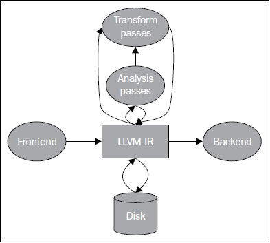

第5章 LLVM中间表示
##################

　　LLVM中间表示（IR）是连接前端和后端的中枢，让LLVM能够解析多种源语言，为多种目标生成代码。前端产生IR，而后端接收IR。IR也是大部分LLVM目标无关的优化发生的地方。在本章中，我们将介绍以下内容：

* LLVM IR的特性
* LLVM IR语言的语法
* 怎样写一个生成LLVM IR的工具
* LLVM IR Pass的结构
* 怎样写你自己的IR Pass

概述
****

　　对于编译器IR的选择是非常重要的决定。它决定了优化器能够得到多少信息用以优化代码使之运行得更快。一方面，非常高层的IR让优化器能够轻松地提炼出原始源代码的意图。另一方面，低层的IR让编译器能够更容易地生成为特定硬件优化的代码。对目标机器知道得越多，发掘机器特性的机会就越多。此外，低层的工作必须小心对待。当编译器将程序翻译为一种更接近机器指令的表示时，映射程序片段到原始源代码会变得愈发困难。更进一步，如果编译器设计夸张地使用一种这样的表示，它非常接近地表示了一种具体的目标机器，那么为其它具有不同结构的机器生成代码会变得很棘手。

　　这种设计权衡导致了编译器之间不同的选择。例如，有的编译器不支持多种目标的代码生成，而是专注一种机器架构。这让他们能够使用专门的IR，贯穿整个流水线，针对单一的架构，让编译器生成高效代码。Intel C++编译器（icc）就是这种例子。然而，编写编译器为单一架构生成代码，这是一种昂贵的方案，如果你打算支持多种目标。在这种情况下，为每种架构写一个不同的编译器是不现实的，最好设计出一个编译器，它能够为多种目标机器生成代码——这是如GCC和LLVM这样的编译器的使命。

　　对于可变目标的编译器（retargetable compiler），它的项目显著地面临着更多的挑战，需要协调多个目标的代码生成。最小化构建一个多目标编译器的关键，在于使用一种通用的IR，它让不同的后端以相同的方式领会源代码程序，并将它翻译为相异的机器指令集。使用通用的IR，可以在多种后端之间共用一系列目标无关的优化算法，但是这要求设计者提升通用IR的层级（level），让它不过度表示某一个机器。因为编译器在较高的层级工作无法运用目标特定的技巧，一个优秀的可变目标编译器也采用其它IR在不同的更低的层级执行优化。

　　LLVM项目开始于一种比Java字节码更低层级的IR，因此，初始的首字母缩略词是Low Level Virtual Machine。它的想法是发掘低层优化的机会，采用链接时优化。将IR作为字节码写到磁盘，这让链接时优化成为可能。字节码让用户能够在同一个文件中混合多个模块，然后运用过程间优化。这样，优化在多个编译单元发生，就像它们在同一模块一样。

　　在第3章（工具和设计）中，我们解释了如今LLVM既不是Java的竞争者，也不是一种虚拟机，它使用其它的中间表示以生成高效代码。例如，除了作为通用IR 的LLVM IR——这是执行目标无关优化的地方，当程序被表示为MachineFunction和MachineInstr类之后，每个后端可能执行目标相关的优化。这些类利用目标机器指令表示程序。

　　另一方面，Function和Instruction类显然是最重要的类，因为它们表示了通用IR，为多种目标所共享。这种中间表示主要是目标无关的（但不完全），是官方的LLVM中间表示。LLVM也用其它层级表示程序，从技术上说，这让它们也成了IR，但是为了避免混淆，我们不把它们称作LLVM IR；不管怎样，Instruction类以及其它构成了官方的通用中间表示, 我们为之保留LLVM IR这个名字。LLVM文档也采用了这个术语。

　　起初LLVM是一系列工具，它们围绕LLVM IR运转，在这个层级运行的优化器数量众多，表现成熟，这是LLVM IR的功劳。这种IR有三种等价形式：

* 驻留内存的表示（指令类等）
* 磁盘上的以空间高效方式编码的位表示（bitcode文件）
* 磁盘上的人类可读文本表示（LLVM汇编文件）

　　LLVM提供了各种工具和程序库，让我们能够操作处理任何形式的IR。因此，这些工具可以从内存到磁盘转换IR，或者反过来，也可以执行优化算法，如下图阐明的那样：

理解LLVM IR的目标依赖
=====================

　　LLVM IR被设计为尽可能地与目标无关，但是它仍然表现出某些目标特定的属性。多数人批评C/C++语言内在的目标依赖的本性。为了理解这个观点，考虑当你在Linux系统上使用标准C头文件时，例如，你的程序隐式地导入一些头文件，从Linux头文件目录bits。这个目录包含目标相关的头文件，其中的一些宏定义约束某些实体使用一个特别的类型，它符合此内核机器的syscalls的期望。随后，举例来说，当前端解析你的代码的时候，也需要为int使用不同的长度，取决于打算在什么目标机器上运行此代码。

　　因此，程序库头文件和C类型已然都是目标相关的，这使得生成目标无关的IR充满挑战，这种IR可以随后被翻译到不同的目标。如果你只考虑目标相关的C标准库头文件，解析一个给定的编译单元得到的AST已然是目标相关的，甚至在翻译为LLVM IR之前。而且，前端生成的IR代码用了类型长度、调用惯例、特殊库调用，这些都得匹配每个目标的ABI所定义的内容。还有，LLVM IR是相当灵活多面的，能够以一种抽象的方法处理各种独特的目标。

练习基础工具转换IR格式
**********************

　　我们提到LLVM IR可以在磁盘上存储为两种格式：bitcode和汇编文本。下面我们将学习如何使用它们。考虑下面的sum.c源代码：

.. code-block:: bash

    int sum(int a, int b) {
      return a+b;
    }

　　为了让Clang生成bitcode，可以用下面的命令：

.. code-block:: bash

    $ clang sum.c -emit-llvm -c -o sum.bc

　　为了生成汇编表示，可以用下面的命令：

.. code-block:: bash

    $ clang sum.c -emit-llvm -S -c -o sum.ll

　　还可以汇编LLVM IR汇编文本，生成bitcode：

.. code-block:: bash

    $ llvm-as sum.ll -o sum.bc

　　为了将bitcode变换为IR汇编，这是反向的，可以使用反汇编器：

.. code-block:: bash

    $ llvm-dis sum.bc -o sum.ll

　　llvm-extract工具能提取IR函数、全局变量，还能从IR模块中删除全局变量。例如，用下面的命令从sum.bc中提取函数sum：

.. code-block:: bash

    $ llvm-extract -func=sum sum.bc -o sum-fn.bc

　　在这个特别的例子中，从sum.bc到sum-fn.bc没有任何变化，因为sum已然是这个模块中唯一的函数。

介绍LLVM IR语言的语法
*********************

　　观察如下LLVM IR汇编文件sum.ll：

.. code-block:: bash

    target datalayout = "e-p:64:64:64-i1:8:8-i8:8:8-i16:16:16-i32:32:32-i64:64:64-f32:32:32-f64:64:64-v64:64:64-v128:128:128-a0:0:64-s0:64:64-f80:128:128-n8:16:32:64-S128"
    target triple = "x86_64-apple-macosx10.7.0"

    define i32 @sum(i32 %a, i32 %b) #0 {
    entry:
      %a.addr = alloca i32, align 4
      %b.addr = alloca i32, align 4
      store i32 %a, i32* %a.addr, align 4
      store i32 %b, i32* %b.addr, align 4
      %0 = load i32, i32* %a.addr, align 4
      %1 = load i32, i32* %b.addr, align 4
      %add = add nsw i32 %0, %1
      ret i32 %add
    }

    attributes #0 = { nounwind ssp uwtable ... }

　　整个LLVM文件的内容，无论汇编或者bitcode，定义了一个所谓的LLVM模块（module）。模块是LLVM IR的顶层数据结构。每个模块包含一系列函数，每个函数包含一系列基本块，每个基本块包含一系列指令。模块还包含一些外围实体以支持其模型，例如全局变量、目标数据布局、外部函数原型，还有数据结构声明。

　　LLVM局部值是汇编语言中的寄存器的模拟，有一个以%符号开头的任意的名字。如此，%add = add nsw i32 %0, %1表示相加局部值%0和%1，结果存放到新的局部值%add。你可自由地赋予这些值任意的名字，但是如果你缺乏创造力，你可以只是用数字。在这个短小的例子中，我们已然看到LLVM如何表达它的基本性质：

* 它采用静态单赋值（SSA）形式。注意没有一个值是被重复赋值的；每个值只有单一赋值定义了它。每次使用一个值，可以立刻向后追溯到给出其定义的唯一的指令。这可以极大地简化优化，因为SSA形式建立了平凡的use-def链，也就是一个值到达使用之处的定义的列表。如果LLVM不采用SSA形式，我们将需要单独运行一次数据流分析，以计算use-def链，对于经典的优化，这是必不可少的，例如常量传播和公共子表达式消除。
* 它以三地址指令组织代码。数据处理指令有两个源操作数，有一个独特的目标操作数以存放结果。
* 它有无限数量的寄存器。注意LLVM局部值可以命名为任意以%符号开头的名字，包括从0开始的数字，例如%0，%1，等等，不限制不同的值的最大数量。

    字段target datalayout包含target triple的字节顺序和类型长度信息，它由target host描述。有些优化必须知道目标的数据布局，才能正确地转换代码。我们来观察layout是如何声明的：

.. code-block:: bash

    target datalayout = "e-p:64:64:64-i1:8:8-i8:8:8-i16:16:16-i32:32:32-i64:64:64-f32:32:32-f64:64:64-v64:64:64-v128:128:128-a0:0:64-s0:64:64-f80:128:128-n8:16:32:64-S128"
    target triple = "x86_64-apple-macosx10.7.0"

　　从上面的字符串，我们可以得知如下事实：

* 目标是一个运行macOSX 10.7.0的x86_64处理器。它是小端字节顺序，这由layout中的第一个字母（小写的e）表示。大端字节顺序用大写的E表示。
* 类型的信息以type:<size>:<abi>:<preferred>的格式提供。在上面的例子中，p:64:64:64表示一个长度为64位的指针，ABI和首选对齐方式都以64位边界对齐。ABI对齐设置一个类型最小所需的对齐，而首选对齐设置一个可能更大的值，如果这是可获利的。32位整数类型i32:32:32，长度是32位，32位ABI和首选对齐，等等。

　　函数声明深度仿效C的语法：

.. code-block:: bash

    define i32 @sum(i32 %a, i32 %b) #0 {

　　这个函数返回一个i32类型的值，有两个i32参数，%a和%b。局部标识符总是使用前缀%，而全局标识符使用@。LLVM支持广泛的类型，但是下面是其最重要的类型：

* 任意长度的整数，表示形式：iN；通常的例子是i32，i64，和i128。
* 浮点类型，例如32位单精度浮点和64位双精度浮点。
* 向量类型，表示格式：<<#elements> x <elementtype>>。包含四个i32元素的向量写为<4 x i32>。

　　函数声明中的标签#0映射到一组函数属性，这也非常类似于C/C++的函数和方法所用的属性。在文件的末尾定义了一组属性：

.. code-block:: bash

    attributes #0 = { nounwind ssp uwtable "disable-tail-calls"="false" "less-precise-fpmad"="false" "no-frame-pointer-elim"="true" "no-frame-pointer-elim-non-leaf" "no-infs-fp-math"="false" "no-nans-fp-math"="false" "stack-protector-buffer-size"="8" "target-cpu"="core2" "target-features"="+cx16,+fxsr,+mmx,+sse,+sse2,+sse3,+ssse3" "unsafe-fp-math"="false" "use-soft-float"="false" }

　　举例来说，nounwind标注一个函数或者方法不抛出异常，ssp告诉代码生成器使用stack smash protector，尽力提供代码安全，防御攻击。

　　函数体被显式地划分成基本块（BB: basic block），标签（label）用于开始一个新的基本块。一个标签关联一个基本块，如同一个值的定义关联一条指令。如果一个标签声明遗漏了，LLVM汇编器会自动生成一个，运用它自己的命名方案。基本块是指令的序列，它的第一条指令是其单一入口点，它的最后一条指令是其单一出口点。这样，当代码跳跃到对应一个基本块的标签时，我们知道它将执行这个基本块中的所有指令，直到最后一条指令——这条指令将改变控制流，跳跃到其它的基本块。基本块和它们关联的标签，需要遵从下面的条件：

* 每个BB需要以一个终结者指令结束，它跳跃到其它BB或者从函数返回
* 第一个BB，称为入口BB，它在一个LLVM函数中是特殊的，不能作为任何跳转指令的目标

　　我们的LLVM文件，sum.ll，只有一个BB，因为它没有跳跃、循环或者调用。函数的开头以entry标签标记，它以返回指令ret结束：

.. code-block:: bash

    entry:
      %a.addr = alloca i32, align 4
      %b.addr = alloca i32, align 4
      store i32 %a, i32* %a.addr, align 4
      store i32 %b, i32* %b.addr, align 4
      %0 = load i32, i32* %a.addr, align 4
      %1 = load i32, i32* %b.addr, align 4
      %add = add nsw i32 %0, %1
      ret i32 %add

　　指令alloca在当前函数的栈帧上预留空间。空间的大小取决于元素类型的长度，而且遵从指定的对齐方式。第一条指令，%a.addr = alloca i32, align 4，分配了一个4字节的栈元素，它遵从4字节对齐。指向栈元素的指针存储在局部标识符%a.addr中。指令alloca通常用以表示局部（自动）变量。

　　利用store指令，参数%a和%b被存储到栈位置%a.addr和%b.addr。这些值通过load指令被加载回来，从相同的内存位置，它们在加法指令%add = add nsw i32 %0, %1中被使用。最后，加法的结果%add由函数返回。nsw标记指定这个加法操作是“no signed wrap”的，表示该操作是已知不会溢出的，允许作某些优化。如果你对nsw标记背后的历史感兴趣，这份LLVMdev帖子是值得一读的： http://lists.cs.uiuc.edu/pipermail/llvmdev/2011-November/045730.html，作者Dan Gohman。

　　实际上，这里的load和store指令是多余的，函数参数可以直接为加法指令所用。Clang默认使用-O0（无优化），不会消除无用的load和store。如果改为用-O1编译，输出的代码简单得多，如下所示：

.. code-block:: bash

    define i32 @sum(i32 %a, i32 %b)
    {
    entry:
      %add = add nsw i32 %b, %a
      ret i32 %add
    }
    ...

　　编写短小的例子测试目标后端，或者以此学习基础的LLVM概念，这时直接使用LLVM汇编是非常便利的。然而，对于前端编写者，我们推荐利用程序库接口构建LLVM IR，这是下一节的主题。你可以在此处查看完整的LLVM IR汇编语法文档： http://llvm.org/docs/LangRef.html。

介绍LLVM IR内存中的模型
=======================

　　驻留内存的表示严密地建模了我们刚刚介绍的LLVM语言语法。表述IR的C++类的头文件位于include/llvm/IR。下面列举了其中最重要的类：

* Module类聚合了整个翻译单元用到的所有数据，它是LLVM术语中的“module”的同义词。它声明了Module::iterator typedef，作为遍历这个模块中的函数的简便方法。你可以用begin()和end()方法获取这些迭代器。在此处查看它的全部接口： http://llvm.org/docs/doxygen/html/classllvm_1_1Module.html。
* Function类包含有关函数定义和声明的所有对象。对于声明来说（用isDeclaration()检查它是否为声明），它仅包含函数原型。无论定义或者声明，它都包含函数参数的列表，可通过getArgumentList()方法或者arg_begin()和arg_end()这对方法访问它。你可以通过Function::arg_iterator typedef遍历它们。如果Function对象代表函数定义，你可以通过这样的语句遍历它的内容：for (Function::iterator i = function.begin(), e = function.end(); i != e; ++i)，你将遍历它的基本块。可在此处查看它的全部接口： http://llvm.org/docs/doxygen/html/classllvm_1_1Function.html。
* BasicBlock类封装了LLVM指令序列，可通过begin()/end()访问它们。你可以利用getTerminator()方法直接访问它的最后一条指令，你还可以用一些辅助函数遍历CFG，例如通过getSinglePredecessor()访问前驱基本块，当一个基本块有单一前驱时。然而，如果它有多个前驱基本块，就需要自己遍历前驱列表，这也不难，你只要逐个遍历基本块，查看它们的终结指令的目标基本块。可在此处查看它的全部接口： http://llvm.org/docs/doxygen/html/classllvm_1_1BasicBlock.html。
* Instruction类表示LLVM IR的运算原子，一个单一的指令。利用一些方法可获得高层级的断言，例如isAssociative()，isCommutative()，isIdempotent()，和isTerminator()，但是它的精确的功能可通过getOpcode()获知，它返回llvm::Instruction枚举的一个成员，代表了LLVM IR opcode。可通过op_begin()和op_end()这对方法访问它的操作数，它从User超类继承得到，我们很快将介绍这个超类。可在此处查看它的全部接口： http://llvm.org/docs/doxygen/html/classllvm_1_1Instruction.html。

　　我们还没介绍LLVM最强大的部分（依托SSA形式）：Value和User接口；它们让你能够轻松操作use-def和def-use链。在LLVM驻留内存的IR中，一个继承自Value的类意味着，它定义了一个结果，可被其它IR使用。而继承自User的子类意味着，这个实体使用了一个或者多个Value接口。Function和Instruction同时是Value和User的子类，而BasicBlock只是Value的子类。为了理解以上内容，让我们深入地分析这两个类：

* Value类定义了use_begin()和use_end()方法，让你能够遍历各个User，为访问它的def-use链提供了轻松的方法。对于每个Value类，你可以通过getName()方法访问它的名字。这个模型决定了任何LLVM值都有一个和它关联的不同的标识。例如，%add1可以标识一个加法指令的结果，BB1可以标识一个基本块，myfunc可以标识一个函数。Value还有一个强大的方法，称为replaceAllUsesWith(Value *)，它遍历这个值的所有使用者，用某个其它的值替代它。这是一个好的例子，演示如何替换指令和编写快速的优化。可在此处查看它的全部接口： http://llvm.org/docs/doxygen/html/classllvm_1_1Value.html。
* User类定义了op_begin()和op_end()方法，让你能够快速访问所有它用到的Value接口。注意这代表了use-def链。你也可以利用一个辅助函数，称为replaceUsesOfWith(Value *From, Value *To)，替换所有它用到的值。可在此处查看它的全部接口： http://llvm.org/docs/doxygen/html/classllvm_1_1User.html。

编写一个定制的LLVM IR生成器
***************************

　　利用LLVM IR生成器API，程序化地为sum.ll构建IR（sum.ll是以-O0优化级别创建的，即没有优化），这是可能的。在这个小节，我们将一步一步地介绍如何实现它。首先，看一看我们需要的头文件：

* #include <llvm/ADT/SmallVector.h>：这是为了引入SmallVector<>模板，这个数据结构帮助我们构建高效的向量，当元素数量不大的时候。查看 http://llvm.org/docs/ProgrammersManual.html 关于LLVM数据结构的介绍。
* #include <llvm/Analysis/Verifier.h>：验证Pass是一个重要的分析，检查你的LLVM模块是否恰当地被构建，遵从IR规则。
* #include <llvm/IR/BasicBlock.h>：这个头文件声明BasicBlock类，这是我们已经介绍过的重要的IR实体。
* #include <llvm/IR/CallingConv.h>：这个头文件定义函数调用用到的一套ABI规则，例如在何处存储函数参数。
* #include <llvm/IR/Function.h>：这个头文件声明Function类，一种IR实体。
* #include <llvm/IR/Instructions.h>：这个头文件声明Instruction类的所有子类，一种基本的IR数据结构。
* #include <llvm/IR/LLVMContext.h>：这个头文件存储LLVM程序库的全局域数据，每个线程使用不同的context，让多线程实现正确工作。
* #include <llvm/IR/Module.h>：这个头文件声明Module类，IR层级结构的顶层实体。
* #include <llvm/Bitcode/ReaderWriter.h>：这个头文件为我们提供了读写LLVM bitcode文件的代码。
* #include <llvm/Support/ToolOutputFile.h>：这个头文件声明了一个辅助类，用以写输出文件。

　　在这个例子中，我们还从llvm名字空间导入符号：

.. code-block:: cpp

    using namespace llvm;

　　现在，是时候以分步的方式编写代码了：

　　1. 我们要写的第一份代码是定义一个新的辅助函数，称为makeLLVMModule，它返回一个指针指向我们的模块实例，即包含所有其它IR对象的顶层IR实体：

.. code-block:: cpp

    Module *makeLLVMModule() {
      Module *mod = new Module("sum.ll", getGlobalContext());
      mod->setDataLayout("e-p:64:64:64-i1:8:8-i8:8:8-i16:16:16-i32:32:32-i64:64:64-f32:32:32-f64:64:64-v64:64:64-v128:128:128-a0:0:64-s0:64:64-f80:128:128-n8:16:32:64-S128");
      mod->setTargetTriple("x86_64-apple-macosx10.7.0");

　　如果我们在模块中指定三元组（triple）和数据布局（data layout）对象，就开启了依赖这些信息的优化，但是需要匹配LLVM后端用到的数据布局和三元组字符串。然而，你可以不指定它们，如果你不关心依赖布局的优化，打算在后端中显式地指定使用什么目标。为了创建一个模块，我们从getGlobalContext()得到当前的LLVM上下文（context），定义模块的名字。我们选择使用被用作模型的文件的名字，sum.ll，但是你可以选择任意其它的模块名字。上下文是LLVMContext类的一个实例，为了保证线程安全，必须按照顺序访问它，因为多线程的IR生成必须给予每个线程一个上下文。setDataLayout()和setTargetTriple()函数让我们能够设置字符串，这些字符串定义了我们的模块的数据布局和三元组。

　　2. 为了声明我们的sum函数，首先定义函数的签名

.. code-block:: cpp

    SmallVector<Type*, 2> FuncTyArgs;
    FuncTyArgs.push_back(IntegerType::get(mod->getContext(), 32));
    FuncTyArgs.push_back(IntegerType::get(mod->getContext(), 32));
    FunctionType *FuncTy = FunctionType::get(/*Result=*/IntegerType::get
                                             (mod->getContext(), 32),
                                             /*Params=*/FuncTyArgs,
                                             /*isVarArg=*/false);

我们的FunctionType对象指定了一个函数，它返回32-bit整数类型，没有变量参数，有两个32-bit整数参数。

　　3. 我们利用Function::Create()静态方法创建了一个函数——输入前面定义的函数类型FuncTy，还有链接类型和模块实例。GlobalValue::ExternalLinkage枚举成员表明这个函数可以被其它模块（翻译单元）引用。

.. code-block:: cpp

    Function *funcSum =
        Function::Create(FuncTy, GlobalValue::ExternalLinkage, "sum", mod);
    funcSum->setCallingConv(CallingConv::C);

　　4. 接着，我们需要存储参数的值指针，为了能够在后面使用它们。为此，我们用到了函数参数的迭代器。int32_a和int32_b分别指向函数的第一个和第二个参数。我们还设置了参数的名字，这是可选的，因为LLVM可以提供临时名字：

.. code-block:: cpp

    Function::arg_iterator args = funcSum->arg_begin();
    Value *int32_a = args++;
    int32_a->setName("a");
    Value *int32_b = args++;
    int32_b->setName("b");

　　5. 作为函数体的开始，我们用标签（或值名字）entry创建了第一个基本块，将其存储为labelEntry指针。我们需要输入这个基本块的所属函数的引用：

.. code-block:: cpp

    BasicBlock *labelEntry =
        BasicBlock::Create(mod->getContext(), "entry", funcSum, 0);

　　6. 现在基本块entry已准备好填充指令了。我们为基本块添加两个alloca指令，建立4字节对齐的32-bit栈元素。调用指令的构建的方法时，需要给出指令所属基本块的引用。默认地，新的指令被插入到基本块的末尾，如下：

.. code-block:: cpp

    AllocaInst *ptrA =
        new AllocaInst(IntegerType::get(mod->getContext(), 32), "a.addr",
                     labelEntry);
    ptrA->setAlignment(4);
    AllocaInst *ptrB =
        new AllocaInst(IntegerType::get(mod->getContext(), 32), "b.addr",
                     labelEntry);
    ptrB->setAlignment(4);

.. note::

    可选地，你可以使用被称作IRBuilder<>的辅助模板类建造IR指令（见  http://llvm.org/docs/doxygen/html/classllvm_1_1IRBuilder.html ）。然而，为了能够向你呈现原始的接口，我们选择不使用它。如果你想使用它，只需要包含头文件llvm/IR/IRBuilder.h，以LLVM Context对象实例化这个类，调用SetInsertPoint()方法指定你想插入新指令的位置。然后，即可调用任意的指令创建方法，例如CreateAlloca()。
　　
　　7. 利用alloca指令返回的指针ptrA和ptrB，我们将函数参数int32_a和int32_b存储到堆栈位置。在此例中，尽管store指令在随后的代码中被st0和st1引用，但是这些指针不会被用到，因为store指令不产生结果。StoreInst的第三个参数指定store是否易变（volatile），此处为false：

.. code-block:: cpp

    StoreInst *st0 = new StoreInst(int32_a, ptrA, false, labelEntry);
    st0->setAlignment(4);
    StoreInst *st1 = new StoreInst(int32_b, ptrB, false, labelEntry);
    st1->setAlignment(4);

　　8. 我们还创建了非易变的load指令，从堆栈位置ld0和ld1加载值。然后，这些值被用作add指令的参数，加法运算的结果——addRes，被作为函数sum的返回值。接着，makeLLVMModule函数返回LLVM IR模块，它包含我们刚刚创建的函数sum：

.. code-block:: cpp

    LoadInst *ld0 = new LoadInst(ptrA, "", false, labelEntry);
    ld0->setAlignment(4);
    LoadInst *ld1 = new LoadInst(ptrB, "", false, labelEntry);
    ld1->setAlignment(4);

    BinaryOperator *addRes = BinaryOperator::Create(Instruction::Add, ld0, ld1,
                                                    "add", labelEntry);
    ReturnInst::Create(mod->getContext(), addRes, labelEntry);

    return mod;

.. note::

    每个指令的创建函数都有大量变种。查阅头文件include/llvm/IR或者doxygen文档，了解所有可能的选项。

　　9. IR生成程序作为一个单独的工具，它需要一个main()函数。在此main()函数中，我们调用makeLLVMModule()创建一个模块，调用verifyModule()验证IR的构建。枚举成员PrintMessageAction指示输出错误消息到stderr，当验证失败的时候。最后，利用函数WriteBitcodeToFile，模块bitcode被写到磁盘，如下面的代码所示：

.. code-block:: cpp

    int main() {
        Module *Mod = makeLLVMModule();
        verifyModule(*Mod, PrintMessageAction);
        std::string ErrorInfo;
        OwningPtr<tool_output_file> Out(new too_output_file("./sum.bc", ErrorInfo, sys::fs::F_None));
        if (!ErrorInfo.empty()) {
          errs() << ErrorInfo << '\n';
          return -1;
        }
        WriteBitcodeToFile(Mod, Out->os());
        Out->keep(); // Declare success
        return 0;
    }

编译并运行IR生成器
==================

　　为了编译这个工具，你可以使用第3章（工具和设计）中的同样的Makefile。Makefile的最关键的部分是llvm-config --libs调用，它定义你的项目将链接哪些LLVM程序库。在此项目中，将使用bitwriter部件，而不是第3章（工具和设计）所用的bitreader部件。因此，修改llvm-config调用为llvm-config --libs bitwriter core support。用下面的命令编译、运行和检查生成的IR：

.. code-block:: bash

    $ make && ./sum && llvm-dis < sum.bc
    ...
    define i32 @sum(i32 %a, i32 %b) {
    entry:
      %a.addr = alloca i32, align 4
      %b.addr = alloca i32, align 4
      store i32 %a, i32* %a.addr, align 4
      store i32 %b, i32* %b.addr, align 4
      %0 = load i32, i32* %a.addr, align 4
      %1 = load i32, i32* %b.addr, align 4
      %add = add nsw i32 %0, %1
      ret i32 %add
    }

学习如何用C++后端生成任意IR的构造代码
====================================

　　llc工具——第6章（后端）有详细的说明——有一个有趣的功能，就是辅助开发者构建IR。这个llc工具能够为一个给定的LLVM IR文件（bitcode或汇编）生成C++源代码，此源代码可以构建生成相同的IR文件。这让构建IR的API易于使用，因为我们能够借助其它已知的IR文件学习如何构建甚至最难懂的IR表达式。LLVM通过C++后端实现这个功能，给llc工具输入参数-march=cpp即可使用这个功能：

.. code-block:: bash

    $ llc -march=cpp sum.bc -o sum.cpp

　　打开sum.cpp文件，注意到生成的C++代码跟我们前面小节所写的很相似。

.. note::

    如果你配置LLVM编译时选择所有目标，那么C++后端是默认包含的。然而，如果你在配置时指定目标，就需要包含C++后端。使用后端名字cpp以包含C++后端，例如，--enable-targets=x86,arm,mips,cpp。

IR层次的优化
*************

　　一旦翻译为LLVM IR，一个程序将经受各种各样的目标无关的代码优化。举例来说，优化可一次作用于一个函数，或者一次作用于一个模块。当优化是过程间优化时，使用后者。为了强化过程间优化的作用，使用者可以利用llvm-link将几个LLVM模块链接在一起成为单个模块。这让优化能够在更大的作用域运行；有时这称为链接时优化，因为它们是编译器中唯一可能超越翻译单元的优化。一个LLVM使用者可以访问所有这些优化，可以利用opt工具个别地调用它们。

编译时和链接时优化
==================

　　opt工具使用一套优化选项，和Clang编译器驱动器的一样：-O0，-O1，-O2，-O3，-Os和Oz。Clang还支持-O4，但是opt不支持。选项-O4是-O3和链接时优化（-flto）的同义词，但是如我们讨论的，在LLVM中开启链接时优化依赖于你如何组织输入文件。每个选项激活不同的优化流水线，它包含一套以特定顺序运行的优化。从Clang手册页面，我们看到下面的说明：

　　*-Ox选项：指定优化级别。-O0表示“不作优化”：这个级别编译最快，生成的代码调试信息最丰富。-O2是一个适度的优化级别，开启了大部分优化。-Os和-O2相似，它额外开启减小代码长度的优化。-Oz和-Os相似，（也和-O2相似），但是它进一步减小代码长度。-O3和-O2相似，除了它开启更多的优化，这些优化执行更长的时间，或者可能产生更长的代码（以试图让程序运行得更快）。在所支持的平台上，-O4开启链接时优化；目标文件以LLVM bitcode文件格式存储，整个程序的优化在链接时进行。-O1是介于-O0和-O2之间的优化级别。*

　　为了利用任意的这些预定义的优化序列，你可以运行opt工具，它操作bitcode文件。例如，下面的命令优化sum.bc bitcode：

.. code-block:: bash

    $ opt -O3 sum.bc -o sum-O3.bc

　　你还可以利用选项激活标准的编译时优化：

.. code-block:: bash

    $ opt -std-compile-opts sum.bc -o sum-stdc.bc

　　或者，你使用一套标准的链接时优化：

.. code-block:: bash

    $ llvm-link file1.bc file2.bc file3.bc -o=all.bc
    $ opt -std-link-opts all.bc -o all-stdl.bc

　　通过opt应用个别的Pass也是可能的。一个非常重要的LLVM Pass是mem2reg，它将alloca提升为LLVM局部值，可能会将它们变换为SSA形式，如果它们变换为局部值之后接受多个赋值。这种情况下，变换将引入phi函数（参考 http://llvm.org/doxygen/classllvm_1_1PHINode.html）——你若自己生成LLVM IR，这是棘手的，但是对于SSA形式是必要的。因此，程序员更喜欢编写依赖alloca、load和store的次优代码，留待mem2reg Pass生成SSA版本，它包含生命期较长的局部值。这个Pass负责优化前面小节的例子sum.c。举例来说，为了运行mem2reg，然后计数模块中的每个指令，以这样的顺序，我们可以执行下面的命令（Pass参数的顺序是要紧的）：

.. code-block:: bash

    $ opt sum.bc -mem2reg -instcount -o sum-tmp.bc -stats
    Statistics collected ...
    1 instcount - Number of Add insts
    1 instcount - Number of Ret insts
    1 instcount - Number of basic blocks
    2 instcount - Number of instructions (of all types)
    1 instcount - Number of non-external functions
    2 mem2reg - Number of alloca's promoted
    2 mem2reg - Number of alloca's promoted with a single store

　　我们利用选项-stats强制让LLVM打印每个Pass的统计信息。否则，指令计数Pass将无声地结束，不报告指令的数目。

　　利用选项-time-passes，我们还可以看到每个优化在总的执行时间中占用了多少执行时间。

.. code-block:: bash

    $ opt sum.bc -time-passes -domtree -instcount -o sum-tmp.bc

　　这里列出了LLVM的分析、转换、辅助Pass的完整清单： http://llvm.org/docs/Passes.html。

.. note::

    Pass顺序问题指出，对代码应用优化的顺序极大地影响它的性能收益，让不同的程序得到最佳优化的顺序是不同的。选项-Ox采用了预定义的优化序列，你应该明白它对于你的程序来说可能不是最佳的。如果你想做一个实验以揭示优化之间复杂的交互，就试着对你的代码运行opt -O3两次，看看它的性能和运行opt -O3一次有何不同（不一定更好）。

发现哪些Pass有用
================

　　优化通常由分析Pass和转换Pass组成。前者发掘性质和优化机会，生成必需的数据结构，后续为后者所用。两者都实现为LLVM Pass，可能有依赖链。

　　在例子sum.ll中，我们看到在优化级别-O0之下，用到了若干alloca、load和store指令。然而，当应用-O1时，所有这些冗余的指令消失了，因为-O1包含mem2reg Pass。然而，如果你不知道mem2reg是重要的，你如何发现哪些Pass对你的程序有用呢？为了理解这个问题，我们把未优化版本称为sum-O0.ll，把优化后版本称为sum-O1.ll。运用-O1就可以得到后者：

.. code-block:: bash

    $ opt -O1 sum-O0.ll -S -o sum-O1.ll

　　然而，如果你想得到更精细的信息，关于哪些转换实际上影响着结果，你可以向clang前端输入-print-stats选项（或者向opt输入-stats）：

.. code-block:: bash

    $ clang -Xclang -print-stats -emit-llvm -O1 sum.c -c -o sum-O1.bc
    ===----------------------------------------------------------------------
    ---===
    ... Statistics Collected ...
    ===----------------------------------------------------------------------
    ---===
    1 cgscc-passmgr - Maximum CGSCCPassMgr iterations on one SCC
    1 functionattrs - Number of functions marked readnone
    2 mem2reg - Number of alloca's promoted with a single store
    1 reassociate - Number of insts reassociated
    1 sroa - Maximum number of partitions per alloca
    2 sroa - Maximum number of uses of a partition
    4 sroa - Number of alloca partition uses rewritten
    2 sroa - Number of alloca partitions formed
    2 sroa - Number of allocas analyzed for replacement
    2 sroa - Number of allocas promoted to SSA values
    4 sroa - Number of instructions deleted

　　以上输出表明，mem2reg和sroa (scalar replacement of aggregates)都去除了冗余的alloca。为了查看一个Pass如何运作，试着只运行sroa：

.. code-block:: bash

    $ opt -sum-O0.ll -stats -sroa -o sum-O1.ll
    ===----------------------------------------------------------------------
    ---===
    ... Statistics Collected ...
    ===----------------------------------------------------------------------
    ---===
    1 cgscc-passmgr - Maximum CGSCCPassMgr iterations on one SCC
    1 functionattrs - Number of functions marked readnone
    2 mem2reg - Number of alloca's promoted with a single store
    1 reassociate - Number of insts reassociated
    1 sroa - Maximum number of partitions per alloca
    2 sroa - Maximum number of uses of a partition
    4 sroa - Number of alloca partition uses rewritten
    2 sroa - Number of alloca partitions formed
    2 sroa - Number of allocas analyzed for replacement
    2 sroa - Number of allocas promoted to SSA values
    4 sroa - Number of instructions deleted

　　注意，sroa也调用mem2reg，即使没有在命令行显式地指定。如果只开启mem2reg，你将看到相同的改进：

.. code-block:: bash

    $ opt -sum-O0.ll -stats -mem2reg -o sum-O1.ll
    ===----------------------------------------------------------------------
    ---===
    ... Statistics Collected ...
    ===----------------------------------------------------------------------
    ---===
    2 mem2reg - Number of alloca's promoted
    2 mem2reg - Number of alloca's promoted with a single store

理解Pass依赖关系
================

　　在转换Pass和分析Pass之间，有两种主要的依赖类型：

* 显式依赖：转换Pass需要一种分析，则Pass管理器自动地安排它所依赖的分析Pass在它之前运行。如果你运行单个Pass，它依赖其它Pass，则Pass管理器会无声地安排必需的Pass在它之前运行。Loop Info和Dominator Tree就是这种分析的例子，它们为其它Pass提供信息。支配者树（dominator tree）是重要的数据结构，它让SSA构建算法能够决定在何处放置phi函数。这样，举例来说，mem2reg在其实现中请求支配者树，通过建立这两个Pass之间的依赖关系：

    .. code-block:: cpp

        DominatorTree &DT = getAnalysis<DominatorTree>(Func);

* 隐式依赖：有些转换或者分析Pass要求IR代码运用特定的成语。以这种方式，它可以轻易地识别模式，即使IR有许多表达相同计算的其它方式。举例来说，如果一个Pass专门地被设计成刚好在另一个转换Pass之后运行，这种隐式依赖就可能出现。因此，这个Pass可能特殊地处理符合特定成语句式的代码（来自前一个Pass）。这种情况，因为这种微妙的依赖是对于一个转换Pass，而不是分析Pass，所以你需要手动地以正确的顺序把这个Pass加到Pass队列中，通过命令行工具（clang或者opt）或者Pass管理器。如果进来的IR不使用这个Pass所期望的成语，这个Pass就无声地跳过其转换，因为它无法匹配代码。一个给定的优化级别所包含的Pass集合是自包含的，不会出现依赖问题。
　　
　　利用opt工具你可以获取相关的信息，关于Pass管理器如何安排Pass，会使用哪些依赖Pass。例如，当你只请求运行mem2reg Pass时，想知道所用到的完整的Pass清单，你可以输入下面的命令：

.. code-block:: bash

    $ opt sum-O0.ll -debug-pass=Structure -mem2reg -S -o sum-O1.ll
    Pass Arguments:  -targetlibinfo -tti -assumption-cache-tracker -domtree -mem2reg -verify -print-module
    Target Library Information
    Target Transform Information
    Assumption Cache Tracker
      ModulePass Manager
        FunctionPass Manager
          Dominator Tree Construction
          Promote Memory to Register
          Module Verifier
        Print module to stderr

　　在Pass参数列表中，我们看到Pass管理器极大地扩展了Pass的数量，使得mem2reg Pass正确运行。例如，domtree Pass是mem2reg所要求的，因此Pass管理器自动包含了它。接着，它详细输出了用于运行每个Pass的结构；直接出现在ModulePass Manager之后的层次状的Pass是基于每个模块运行的，而在FunctionPass下面的层次状的Pass是基于每个函数运行的。我们还可以看到Pass执行的顺序，Promote Memory to Register Pass在它的依赖者Dominator Tree Construction Pass之后运行。

理解Pass API
============

　　Pass类是实现优化的主要资源。然而，我们从不直接使用它，而是通过清楚的子类使用它。当实现一个Pass时，你应该选择适合你的Pass的最佳粒度，适合此粒度的最佳子类，例如基于函数、模块、循环、强联通区域，等等。常见的这些子类如下：

* ModulePass：这是最通用的Pass；它一次分析整个模块，函数的次序不确定。它不限定使用者的行为，允许删除函数和其它修改。为了使用它，你需要写一个类继承ModulePass，并重载runOnModule()方法。
* FunctionPass：这个子类允许一次处理一个函数，处理函数的次序不确定。这是应用最多的Pass类型。它禁止修改外部函数、删除函数、删除全局变量。为了使用它，需要写一个它的子类，重载runOnFunction()方法。
* BasicBlockPass：这个类的粒度是基本块。FunctionPass类禁止的修改在这里也是禁止的。它还禁止修改或者删除外部基本块。使用者需要写一个类继承BasicBlockPass，并重载它的runOnBasicBlock()方法。
　　
　　被重载的入口函数runOnModule()、runOnFunction()、runOnBasicBlock()返回布尔值false，如果被分析的单元（模块、函数和基本块）保持不变，否则返回布尔值true。参考关于Pass子类的完整文档： http://llvm.org/docs/WritingAnLLVMPass.html。

写一个定制的Pass
================

　　假设我们想要计数一个程序中每个函数的参数的数目，输出函数的名字。让我们写一个Pass实现它。首先，我们需要选择正确的Pass的子类。FunctionPass看起来是适合的，因为我们对函数次序没有要求，不需要删除任何东西。

　　我们把Pass命名为FnArgCnt，放在LLVM源代码树中：

.. code-block:: bash

    $ cd <llvm_source_tree>
    $ mkdir lib/Transforms/FnArgCnt
    $ cd lib/Transforms/FnArgCnt

　　文件FnArgCnt.cpp，位于lib/Transforms/FnArgCnt，需要实现这个Pass，内容如下：

.. code-block:: cpp

    #include "llvm/IR/Function.h"
    #include "llvm/Pass.h"
    #include "llvm/Support/raw_ostream.h"

    using namespace llvm;

    namespace {
      class FnArgCnt : public FunctionPass {
      public:
        static char ID;
        FnArgCnt() : FunctionPass(ID) {}

        virtual bool runOnFunction(Function &F) {
          errs() << "FnArgCnt --- ";
          errs() << F.getName() << ": ";
          errs() << F.getArgumentList().size() << '\n';
          return false;
        }
      };
    }

    char FnArgCnt::ID = 0;
    static RegisterPass<FnArgCnt> X("fnargcnt", "Function Argument Count Pass", false, false);

　　首先，包含必需的头文件，从llvm名字空间采集符号：

.. code-block:: cpp

    #include "llvm/IR/Function.h"
    #include "llvm/Pass.h"
    #include "llvm/Support/raw_ostream.h"

    using namespace llvm;

　　接着，我们声明FnArgCnt——我们的函数Pass子类——并在runOnFunction()方法中实现主要的Pass功能。在每个函数的上下文中，我们打印函数名字和它接收的参数的数目。这个函数返回false，因为没有修改被分析的函数。我们的子类的代码如下：

.. code-block:: cpp

    namespace {
      class FnArgCnt : public FunctionPass {
      public:
        static char ID;
        FnArgCnt() : FunctionPass(ID) {}

        virtual bool runOnFunction(Function &F) {
          errs() << "FnArgCnt --- ";
          errs() << F.getName() << ": ";
          errs() << F.getArgumentList().size() << '\n';
          return false;
        }
      };
    }

　　ID由LLVM内部决定，用以识别一个Pass，它可以声明为任意值：

.. code-block:: cpp

    char FnArgCnt::ID = 0;

　　最后，我们处理Pass注册机制，它用当前Pass管理器在Pass加载时间注册它：

.. code-block:: cpp

    char FnArgCnt::ID = 0;
    static RegisterPass<FnArgCnt> X("fnargcnt", "Function Argument Count Pass", false, false);

　　第1个参数，fnargcnt，是Pass的名字，opt工具用它识别这个Pass，而第2个参数是它的扩充名字。第3个参数指示这个Pass是否修改当前CFG，最后的参数指示它是不是一个分析Pass。

在LLVM编译系统中编译和运行你的新Pass
-----------------------------------

　　为了编译和安装这个Pass，我们需要一个Makefile，放在源代码的目录中。和前面的项目不同，我们不再是编译一个独立工具，这个Makefile将被集成到LLVM编译系统。因为它依赖LLVM主Makefile，主Makefile实现了大量规则，所以它的内容比独立工具的Makefile简单得多。参考下面的代码：

.. code-block:: bash

    # Makefile for FnArgCnt pass

    # Path to top level of LLVM hierarchy
    LEVEL = ../../..

    # Name of the library to build
    LIBRARYNAME = LLVMFnArgCnt

    # Make the shared library become a loadable module so the tools can
    # dlopen/dlsym on the resulting library.
    LOADABLE_MODULE = 1

    # Include the makefile implementation stuff
    include $(LEVEL)/Makefile.common

　　Makefile中的注释是自我解释的，这里利用公用的LLVM Makefile创建了一个共享库。利用此基础设施，我们的Pass和其它的标准Pass被安装在一起，可以直接被opt加载，但是这需要你重新编译安装LLVM。

　　我们还想让我们的Pass在目标目录中编译，这需要在Transforms目录的Makefile中包含我们的Pass。因此，在lib/Transforms/Makefile中，需要修改PARALLEL_DIRS变量，让它包含FnArgCnt Pass：

.. code-block:: bash

    PARALLEL_DIRS = Utils Instrumentation Scalar InstCombine IPO Vectorize Hello ObjCARC FnArgCnt

　　根据第1章（编译和安装LLVM）的说明，需要重新配置LLVM项目：

.. code-block:: bash

    $ cd path-to-build-dir
    $ /PATH_TO_SOURCE/configure --prefix=/your/installation/folder

　　现在，离开目标目录，转到新Pass的目录，运行make：

.. code-block:: bash

    $ cd lib/Transforms/FnArgCnt
    $ make

　　一个共享库将会出现在编译树下的Debug+Asserts/lib目录中。Debug+Asserts应该被替换为你的配置模式，例如Release，如果你配置了release build。下面，调用opt运行这个定制的Pass（在Mac OS X中）：

.. code-block:: bash

    $ opt -load <path_to_build_dir>/Debug+Asserts/lib/LLVMFnArgCnt.dylib -fnargcnt < sum.bc >/dev/null
    FnArgCnt --- sum: 2

　　在Linux中需要使用恰当的共享库扩展名（.so）。和期望的一样，sum.bc模块只有一个函数，它有两个整数参数，如前面的输出显示的那样。

　　你还可以选择重新编译整个LLVM系统并重新安装。编译系统会安装一个新的opt程序，不需要输入-load命令行参数，它就能识别你的Pass。

用你自己的Makefile编译和安装你的新Pass
--------------------------------------

　　依赖于LLVM编译系统可能是件麻烦事，例如需要重新配置整个项目，或者重新编译新的代码和所有LLVM工具。然而，我们可以创建一个独立的Makefile，它在LLVM源代码树之外编译我们的Pass，和之前我们编译项目一样。不依赖于LLVM源代码树是令人舒适的，有时这是值得付出额外的努力建立你自己的Makefile的。

　　我们的独立Makefile将以第3章（工具和设计）中的Makefile为基础。这里的挑战是，我们不再是编译一个工具，而是一个共享库，即编译我们的Pass的代码得到一个共享库，它可以被opt工具随时地加载。

　　首先，我们为我们的项目创建一个单独的文件夹，它不在LLVM源代码树中。我们把Pass的实现代码FnArgCnt.cpp文件放在里面。第二，我们创建如下的Makefile：

.. code-block:: bash

    LLVM_CONFIG?=llvm-config

    ifndef VERBOSE
    QUIET:=@
    endif

    SRC_DIR?=$(PWD)
    LDFLAGS+=$(shell $(LLVM_CONFIG) --ldflags)
    COMMON_FLAGS=-Wall -Wextra
    CXXFLAGS+=$(COMMON_FLAGS) $(shell $(LLVM_CONFIG) --cxxflags) -fno-rtti
    CPPFLAGS+=$(shell $(LLVM_CONFIG) --cppflags) -I$(SRC_DIR)

    ifeq ($(shell uname),Darwin)
    LOADABLE_MODULE_OPTIONS=-bundle -undefined dynamic_lookup
    else
    LOADABLE_MODULE_OPTIONS=-shared -Wl,-O1
    endif

    FNARGPASS=fnarg.so
    FNARGPASS_OBJECTS=FnArgCnt.o

    default: $(FNARGPASS)

    %.o : $(SRC_DIR)/%.cpp
    	@echo Compiling $*.cpp
    	$(QUIET)$(CXX) -c $(CPPFLAGS) $(CXXFLAGS) $<

    $(FNARGPASS) : $(FNARGPASS_OBJECTS)
    	@echo Linking $@
    	$(QUIET)$(CXX) -o $@ $(LOADABLE_MODULE_OPTIONS) $(CXXFLAGS) $(LDFLAGS) $^

    clean::
    	$(QUIET)rm -rf $(FNARGPASS_OBJECTS) $(FNARGPASS)

　　对比第3章（工具和设计）中的Makefile，这个Makefile的新颖之处（代码中高亮的部分），在于条件化定义LOADABLE_MODULE_OPTIONS变量，链接我们的共享库的命令行会用到它。它定义了平台相关的一套编译器选项，指导生成一个共享库而不是可执行文件。例如，对于Linux，它使用-shared选项以创建共享库，以及-W1 -O1选项，-O1选项传递给GNU ld。这个选项要求GNU链接器执行符号表优化，减少程序库加载时间。如果你不使用GNU链接器，可以忽略这个选项。

　　我们还从链接器命令行中去除了llvm-config --libs这个shell命令。这个命令用于给出我们的项目要链接的程序库。因为我们知道opt可执行文件已经含有我们用到的所有符号，所以我们简单地不包含任何冗余的程序库，以加快链接速度。

　　用下面的命令编译你的项目：

.. code-block:: bash

    $ make

　　你的Pass被编译成了fnarg.so，用下面的命令运行它：

.. code-block:: bash

    $ opt -load=fnarg.so -fnargcnt < sum.c > /dev/null
    FnArgCnt --- sum: 2

总结
****

　　LLVM IR是前端（frontend）和后端（backend）的桥梁。这是目标无关优化发生的地方。在本章中，我们介绍了操纵LLVM IR的工具，研究了汇编语法，以及如何编写一个定制的IR代码生成器。此外，我们展示了Pass接口如何工作，如何应用优化，然后通过例子介绍如何编写我们自己的IR转换或者分析Pass。

　　在下一章中，我们将讨论LLVM后端如何工作，如何建立自己的后端将LLVM IR代码翻译为一个定制的架构的指令。
